# Arquitectura — Portal de Declaración de Renta

Documento para desarrolladores. Explica **cómo está construido** el sistema:
infraestructura, backend, frontend, modelo de datos, patrones de diseño y los
flujos críticos, con diagramas.

- Referencia operativa (endpoints, `.env`, despliegue): [MANUAL-TECNICO.md](MANUAL-TECNICO.md)
- Manual de uso (para la contadora y sus clientes): [MANUAL-USUARIO.md](MANUAL-USUARIO.md)
- Fundamentación tributaria del Liquidador: [reglas-tributarias-AG2025.md](reglas-tributarias-AG2025.md)

> Los diagramas están en Mermaid y se renderizan solos en GitHub, GitLab y en
> VS Code con la extensión *Markdown Preview Mermaid Support*.

---

## Índice

1. [Contexto del sistema](#1-contexto-del-sistema)
2. [Infraestructura y despliegue](#2-infraestructura-y-despliegue)
3. [Backend](#3-backend)
4. [Frontend](#4-frontend)
5. [Modelo de datos](#5-modelo-de-datos)
6. [Motor de cálculo `motor210`](#6-motor-de-cálculo-motor210)
7. [Flujos críticos (secuencias)](#7-flujos-críticos-secuencias)
8. [Máquinas de estado](#8-máquinas-de-estado)
9. [Patrones de diseño aplicados](#9-patrones-de-diseño-aplicados)
10. [Seguridad transversal](#10-seguridad-transversal)
11. [Pruebas](#11-pruebas)
12. [Decisiones de arquitectura y sus porqués](#12-decisiones-de-arquitectura-y-sus-porqués)

---

## 1. Contexto del sistema

Una contadora gestiona declaraciones de renta de personas naturales en Colombia.
El sistema cubre tres necesidades: **avisar** a los clientes, **recibir** sus
documentos y **liquidar** el Formulario 210.

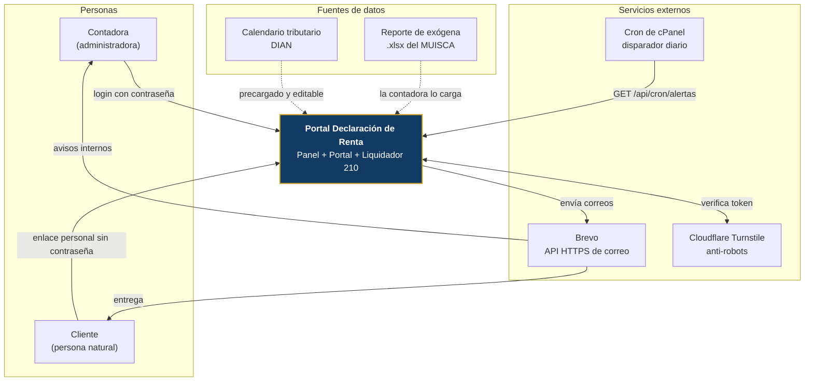
```mermaid
graph TB
    subgraph Personas
        A["Contadora<br/>(administradora)"]
        B["Cliente<br/>(persona natural)"]
    end

    S["<b>Portal Declaración de Renta</b><br/>Panel + Portal + Liquidador 210"]

    subgraph Servicios externos
        E1["Brevo<br/>API HTTPS de correo"]
        E2["Cloudflare Turnstile<br/>anti-robots"]
        E3["Cron de cPanel<br/>disparador diario"]
    end

    subgraph Fuentes de datos
        F1["Reporte de exógena<br/>.xlsx del MUISCA"]
        F2["Calendario tributario<br/>DIAN"]
    end

    A -->|"login con contraseña"| S
    B -->|"enlace personal sin contraseña"| S
    S -->|"envía correos"| E1
    E1 -->|"entrega"| B
    E1 -->|"avisos internos"| A
    S <-->|"verifica token"| E2
    E3 -->|"GET /api/cron/alertas"| S
    F1 -.->|"la contadora lo carga"| S
    F2 -.->|"precargado y editable"| S

    style S fill:#123a63,color:#fff,stroke:#c9a227,stroke-width:2px
```

### Los tres subsistemas

| Subsistema | Quién lo usa | Autenticación | Dónde corre la lógica |
|---|---|---|---|
| **Panel de administración** | La contadora | Contraseña → token HMAC de 12 h | Servidor + navegador |
| **Portal del cliente** | Cada cliente | *Magic link* permanente por correo | Servidor + navegador |
| **Liquidador 210** | La contadora | El mismo token del panel | **100 % navegador** |

El Liquidador merece énfasis: el servidor **nunca calcula ni ve** ingresos,
patrimonio ni exógena. Solo guarda un blob cifrado que no puede interpretar
(§6 y §7.4).

---

## 2. Infraestructura y despliegue

Hosting compartido cPanel (LiteSpeed + Passenger), **con acceso SSH completo**.
Esa plataforma explica buena parte del diseño: procesos que se reciclan solos,
el app root que es también el document root, y un filtro de correo saliente
agresivo.

> **Nota histórica.** El proyecto se construyó cuando este hosting **no tenía
> shell** y todo se desplegaba por SFTP. Varias decisiones nacieron de esa
> restricción, que **ya está levantada**. Se conservan porque siguen siendo
> razonables, no porque sigan siendo obligatorias — están marcadas abajo y en
> [§12](#12-decisiones-de-arquitectura-y-sus-porqués) para que nadie herede una
> restricción que ya no existe.

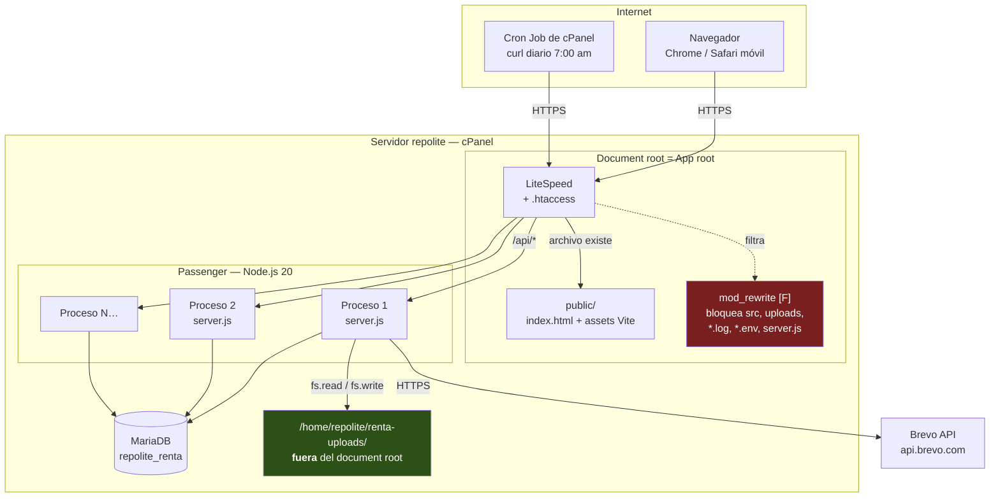
```mermaid
graph TB
    subgraph Internet
        NAV["Navegador<br/>Chrome / Safari móvil"]
        CRON["Cron Job de cPanel<br/>curl diario 7:00 am"]
    end

    subgraph "Servidor repolite — cPanel"
        subgraph "Document root = App root"
            LS["LiteSpeed<br/>+ .htaccess"]
            EST["public/<br/>index.html + assets Vite"]
            HTA["mod_rewrite [F]<br/>bloquea src, uploads,<br/>*.log, *.env, server.js"]
        end

        subgraph "Passenger — Node.js 20"
            P1["Proceso 1<br/>server.js"]
            P2["Proceso 2<br/>server.js"]
            PN["Proceso N…"]
        end

        DB[("MariaDB<br/>repolite_renta")]
        UP["/home/repolite/renta-uploads/<br/><b>fuera</b> del document root"]
    end

    BREVO["Brevo API<br/>api.brevo.com"]

    NAV -->|HTTPS| LS
    CRON -->|HTTPS| LS
    LS -->|"archivo existe"| EST
    LS -.->|"filtra"| HTA
    LS -->|"/api/*"| P1
    LS --> P2
    LS --> PN
    P1 --> DB
    P2 --> DB
    PN --> DB
    P1 -->|"fs.read / fs.write"| UP
    P1 -->|HTTPS| BREVO

    style UP fill:#2d5016,color:#fff
    style HTA fill:#7a1f1f,color:#fff
```

### Consecuencias de esta infraestructura

| Restricción del hosting | Cómo se resolvió |
|---|---|
| Passenger corre **varios procesos** y los recicla | Autenticación **sin estado** (HMAC); nada de sesiones en memoria |
| El estado en memoria no se comparte | El *dedupe* de avisos vive en la tabla `envios`, no en RAM |
| ~~Sin shell para desplegar~~ *(ya no aplica)* | Nació de ahí la política de cero dependencias nuevas (`seguridad.js` no usa `helmet`). Hoy se despliega por SSH y `npm install` corre en el servidor |
| El app root **es** el document root | `.htaccess` con reglas `[F]` + uploads movidos fuera del árbol web |
| LiteSpeed sirve estáticos **sin pasar por Node** | Las cabeceras de seguridad se replican en `.htaccess` |
| El filtro saliente marca el SMTP local como spam | Correo por **API HTTPS de Brevo**, no por SMTP |
| Límite de conexiones MySQL por cuenta | `connectionLimit: 4` en el pool |

### Pipeline de despliegue

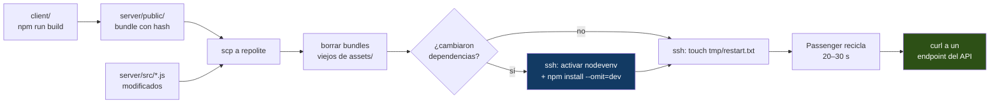
```mermaid
flowchart LR
    A["client/<br/>npm run build"] --> B["server/public/<br/>bundle con hash"]
    B --> C["scp a repolite"]
    D["server/src/*.js<br/>modificados"] --> C
    C --> C2["borrar bundles<br/>viejos de assets/"]
    C2 --> N{"¿cambiaron<br/>dependencias?"}
    N -->|sí| NPM["ssh: activar nodevenv<br/>+ npm install --omit=dev"]
    N -->|no| E
    NPM --> E["ssh: touch tmp/restart.txt"]
    E --> F["Passenger recicla<br/>20–30 s"]
    F --> G["curl a un<br/>endpoint del API"]

    style G fill:#2d5016,color:#fff
    style NPM fill:#123a63,color:#fff
```

> Verificar contra un endpoint del **API**, nunca contra un estático:
> LiteSpeed sirve los archivos sin tocar Node y daría un falso positivo.

**`node` y `npm` no están en el `PATH`**: los pone el virtualenv de CloudLinux,
que hay que activar en cada sesión SSH
(`source ~/nodevenv/declaraciones-renta-pn.repolite.link/20/bin/activate`).
El servidor tiene `git`, `mysql`, `mysqldump`, `crontab`, `curl` y `zip`;
**no tiene `rsync`**. Comandos concretos en
[MANUAL-TECNICO §9](MANUAL-TECNICO.md#9-desarrollo-local-y-despliegue).

---

## 3. Backend

Express 4 sobre Node 20. Arquitectura **en capas**, con una regla dura: *todo
el SQL vive en `datos.js`*.

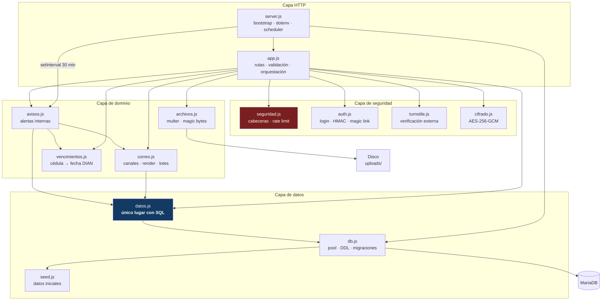
```mermaid
graph TD
    subgraph "Capa HTTP"
        SRV["server.js<br/>bootstrap · dotenv · scheduler"]
        APP["app.js<br/>rutas · validación · orquestación"]
    end

    subgraph "Capa de seguridad"
        SEG["seguridad.js<br/>cabeceras · rate limit"]
        AUT["auth.js<br/>login · HMAC · magic link"]
        TUR["turnstile.js<br/>verificación externa"]
        CIF["cifrado.js<br/>AES-256-GCM"]
    end

    subgraph "Capa de dominio"
        COR["correo.js<br/>canales · render · lotes"]
        AVI["avisos.js<br/>alertas internas"]
        VEN["vencimientos.js<br/>cédula → fecha DIAN"]
        ARC["archivos.js<br/>multer · magic bytes"]
    end

    subgraph "Capa de datos"
        DAT["datos.js<br/><b>único lugar con SQL</b>"]
        DB["db.js<br/>pool · DDL · migraciones"]
        SEED["seed.js<br/>datos iniciales"]
    end

    MYSQL[("MariaDB")]
    DISCO["Disco<br/>uploads/"]

    SRV --> APP
    SRV --> DB
    SRV -->|"setInterval 30 min"| AVI
    APP --> SEG
    APP --> AUT
    APP --> TUR
    APP --> CIF
    APP --> COR
    APP --> AVI
    APP --> VEN
    APP --> ARC
    APP --> DAT
    COR --> DAT
    AVI --> DAT
    AVI --> COR
    AVI --> VEN
    DAT --> DB
    DB --> SEED
    DB --> MYSQL
    ARC --> DISCO

    style DAT fill:#123a63,color:#fff
    style SEG fill:#7a1f1f,color:#fff
```

### Responsabilidad de cada módulo

| Módulo | Responsabilidad única | No hace |
|---|---|---|
| `server.js` | Cargar `.env`, `db.init()`, `listen`, timer de alertas | Nada de rutas |
| `app.js` | Definir rutas, validar entrada, componer servicios | Nada de SQL |
| `datos.js` | Todo el SQL + mapeo fila → objeto de dominio | No conoce HTTP ni `req`/`res` |
| `db.js` | Pool, DDL idempotente, migraciones | No sabe de negocio |
| `auth.js` | Emitir/validar tokens, bloquear fuerza bruta | No toca la base de datos |
| `correo.js` | Elegir canal, renderizar plantillas, enviar en lote | No decide *cuándo* enviar |
| `avisos.js` | Decidir *cuándo* avisar a la contadora + *dedupe* | No renderiza correos de clientes |
| `archivos.js` | Guardar, validar y borrar archivos en disco | No sabe qué representa el archivo |
| `cifrado.js` | Cifrar/descifrar un string | No sabe qué está cifrando |
| `seguridad.js` | Cabeceras HTTP + limitador por IP | No autentica |

### Cadena de middleware (Chain of Responsibility)

Cada petición atraviesa una cadena que se corta en el primer eslabón que
rechaza. Los dos routers están registrados en un orden que importa:


```mermaid
flowchart TD
    REQ["Petición HTTP"] --> TP["trust proxy<br/>resuelve req.ip real"]
    TP --> CAB["cabeceras()<br/>CSP · HSTS · no-store"]
    CAB --> JSON["express.json<br/>límite 2 MB"]
    JSON --> Q{"¿ruta?"}

    Q -->|"/api/portal/*"| LP["limitePortal<br/>120 / 5 min"]
    Q -->|"/api/*"| LA["limiteApi<br/>600 / 5 min"]
    Q -->|"resto"| STA["estáticos + SPA fallback"]

    LP --> RP{"subruta"}
    RP -->|"/recuperar"| LS1["limiteSensible<br/>10 / 15 min"]
    RP -->|"/:token/documentos"| LSU["limiteSubidas<br/>60 / 10 min"]
    RP -->|"otras"| CCP

    LS1 --> TURN["verificarTurnstile"]
    LSU --> CCP["cargarClientePortal<br/>valida HMAC del enlace"]
    CCP --> MUL["subirArchivo<br/>multer + magic bytes"]
    MUL --> H1["handler"]

    LA --> EX{"¿excepción?"}
    EX -->|"/cron/alertas"| CRO["compara CRON_SECRET<br/>en tiempo constante"]
    EX -->|"/login"| LS2["limiteSensible → login()"]
    EX -->|"resto"| AUTH["requiereAuth<br/>Bearer HMAC"]
    AUTH --> H2["handler"]

    H1 --> WRAP["ruta&#40;fn&#41;<br/>captura errores async → JSON 500"]
    H2 --> WRAP
    WRAP --> RES["Respuesta"]

    style CAB fill:#7a1f1f,color:#fff
    style AUTH fill:#7a1f1f,color:#fff
    style CCP fill:#7a1f1f,color:#fff
```

> **Orden crítico**: `/api/portal` se registra **antes** que `/api`. Lo que no
> coincida con una ruta del portal cae al router `/api` y termina en el 401 de
> `requiereAuth` — nunca queda una ruta del portal accidentalmente pública en
> el router equivocado.

---

## 4. Frontend

React 18 + Vite. **Sin router externo**: `main.jsx` decide la vista con una
expresión regular sobre `window.location.pathname`. Sin framework de CSS: un
solo `styles.css` con la paleta de marca en `:root`. Sin gestor de estado
global: `useState` local y props.


```mermaid
graph TD
    MAIN["main.jsx<br/>enrutado por regex"]

    MAIN -->|"/portal/:token<br/>o /portal"| PORTAL["Portal.jsx<br/><i>vista del cliente</i>"]
    MAIN -->|"/terminos"| TER["Legal.jsx → Terminos"]
    MAIN -->|"/privacidad"| PRI["Legal.jsx → Privacidad"]
    MAIN -->|"cualquier otra"| APP["App.jsx<br/><i>panel</i>"]

    APP -->|"sin token"| LOGIN["Login.jsx<br/>+ Turnstile.jsx"]
    APP -->|"con token"| SHELL["Shell: barra · drawer móvil · guía"]
    SHELL --> GUIA["Guia.jsx<br/>tour de primer ingreso"]

    SHELL --> T1["Clientes.jsx<br/>+ ImportarExcel.jsx"]
    SHELL --> T2["Correos.jsx"]
    SHELL --> T3["Revision.jsx"]
    SHELL --> T4["Plantillas.jsx"]
    SHELL --> T5["Calendario.jsx"]
    SHELL --> T6["Liquidador210.jsx"]

    T6 --> WIZ["liquidador210/Wizard.jsx"]

    subgraph "Wizard — 9 pasos"
        WIZ --> P1["PasoExogena"]
        WIZ --> P2["PasoCedulas"]
        WIZ --> P3["PasoGananciaOcasional"]
        WIZ --> P4["PasoPatrimonio"]
        WIZ --> P5["PasoAnticipo"]
        WIZ --> P6["PasoImpuesto"]
        WIZ --> P7["PasoFormulario210"]
        WIZ --> P8["PasoResultado"]
        P8 --> ANX["AnexosDeclaracion<br/>+ AnexosPDF"]
    end

    WIZ ==>|"llama en cada render"| MOTOR["motor210/<br/><b>lógica pura</b>"]

    ALL["api.js<br/>api&#40;&#41; · apiFormulario&#40;&#41; · apiArchivo&#40;&#41;"]
    T1 -.-> ALL
    T2 -.-> ALL
    T3 -.-> ALL
    T4 -.-> ALL
    T5 -.-> ALL
    WIZ -.-> ALL

    style MOTOR fill:#123a63,color:#fff
    style PORTAL fill:#2d5016,color:#fff
```

### La capa `api.js`

Tres funciones, un solo lugar donde se decide qué pasa con el token:

| Función | Para qué | Detalle |
|---|---|---|
| `api(ruta, opciones)` | JSON | Serializa el body, pone `Authorization: Bearer` |
| `apiFormulario(ruta, formData)` | Subir archivos | **No** fija `Content-Type`: el navegador debe poner el *boundary* |
| `apiArchivo(ruta)` | Descargar binarios | Devuelve un `Blob`; los archivos nunca son estáticos públicos |

Las tres comparten el mismo manejo de sesión expirada:

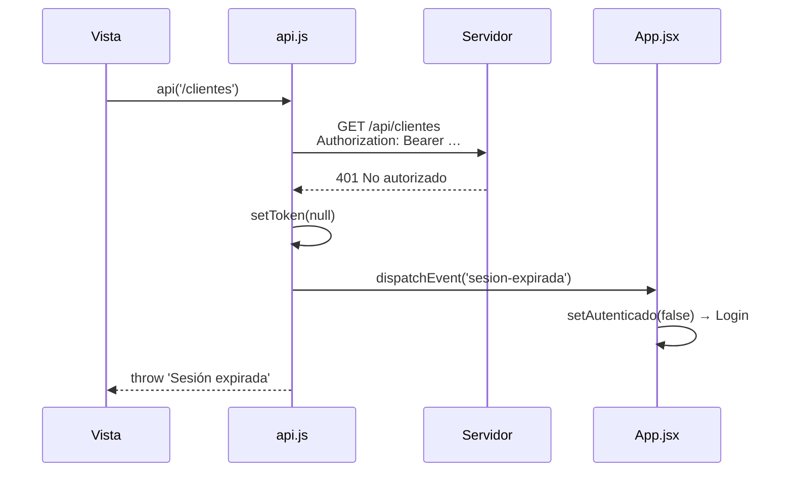
```mermaid
sequenceDiagram
    participant V as Vista
    participant A as api.js
    participant S as Servidor
    participant APP as App.jsx

    V->>A: api('/clientes')
    A->>S: GET /api/clientes<br/>Authorization: Bearer …
    S-->>A: 401 No autorizado
    A->>A: setToken(null)
    A->>APP: dispatchEvent('sesion-expirada')
    APP->>APP: setAutenticado(false) → Login
    A-->>V: throw 'Sesión expirada'
```

Un **evento del `window`** en lugar de un contexto de React: cualquier módulo
puede provocar el logout sin que las vistas tengan que propagarlo hacia arriba.

### Convenciones del frontend

- **Configuración declarativa en tablas**: `PESTANAS` en `App.jsx`, `PASOS` en
  `Wizard.jsx` y `Guia.jsx`, `FILAS_RESUMEN` en `PasoResultado.jsx`,
  `ENTREGA_TITULOS` en `Portal.jsx`. Agregar una pestaña o un paso es agregar
  una fila, no tocar el `render`.
- **Móvil primero**: el drawer del panel y todo el Portal del cliente están
  diseñados para 390 px. Los clientes suben fotos de sus soportes desde el
  celular.
- **Español en todo**: nombres de variables, funciones y comentarios. Los
  comentarios explican el *por qué*, no el *qué*.

---

## 5. Modelo de datos

MariaDB, **sin ORM y sin archivos de migración**. `db.init()` corre en cada
arranque: `CREATE TABLE IF NOT EXISTS` para el esquema y migraciones puntuales
que consultan `information_schema` antes de aplicar un `ALTER`. Todo
idempotente.

### Diagrama entidad-relación

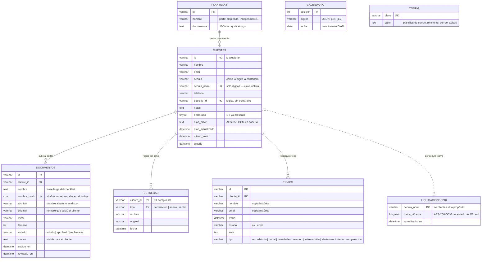
```mermaid
erDiagram
    CLIENTES ||--o{ DOCUMENTOS : "sube al portal"
    CLIENTES ||--o{ ENTREGAS : "recibe del panel"
    CLIENTES ||--o{ ENVIOS : "registra correos"
    PLANTILLAS ||--o{ CLIENTES : "define checklist de"
    CLIENTES |o..o| LIQUIDACIONES210 : "por cedula_norm"

    CLIENTES {
        varchar id PK "id aleatorio"
        varchar nombre
        varchar email
        varchar cedula "como la digitó la contadora"
        varchar cedula_norm UK "solo dígitos — clave natural"
        varchar telefono
        varchar plantilla_id FK "lógica, sin constraint"
        text notas
        tinyint declarado "1 = ya presentó"
        text dian_clave "AES-256-GCM en base64"
        datetime dian_actualizado
        datetime ultimo_envio
        datetime creado
    }

    PLANTILLAS {
        varchar id PK
        varchar nombre "perfil: empleado, independiente…"
        text documentos "JSON array de strings"
    }

    DOCUMENTOS {
        varchar id PK
        varchar cliente_id FK
        text nombre "frase larga del checklist"
        char nombre_hash UK "sha1(nombre) — cabe en el índice"
        varchar archivo "nombre aleatorio en disco"
        varchar original "nombre que subió el cliente"
        varchar mime
        int tamano
        varchar estado "subido | aprobado | rechazado"
        text motivo "visible para el cliente"
        datetime subido_en
        datetime revisado_en
    }

    ENTREGAS {
        varchar cliente_id PK "PK compuesta"
        varchar tipo PK "declaracion | anexo | recibo"
        varchar archivo
        varchar original
        datetime fecha
    }

    ENVIOS {
        varchar id PK
        varchar cliente_id FK
        varchar nombre "copia histórica"
        varchar email "copia histórica"
        datetime fecha
        varchar estado "ok | error"
        text error
        varchar tipo "recordatorio | portal | novedades | revision | aviso-subida | alerta-vencimiento | recuperacion"
    }

    CALENDARIO {
        int posicion PK
        varchar digitos "JSON, p.ej. [1,2]"
        date fecha "vencimiento DIAN"
    }

    CONFIG {
        varchar clave PK
        text valor "plantillas de correo, remitente, correo_avisos"
    }

    LIQUIDACIONES210 {
        varchar cedula_norm PK "no clientes.id, a propósito"
        longtext datos_cifrados "AES-256-GCM del estado del Wizard"
        datetime actualizado_en
    }
```

### Notas de modelado que no se ven en el diagrama

| Decisión | Porqué |
|---|---|
| **Sin `FOREIGN KEY`** en el DDL | Las relaciones se validan en `datos.js`. Evita fallos de arranque si una tabla se creó antes que otra y sobrevive a restauraciones parciales del hosting |
| `documentos.nombre_hash` = `sha1(nombre)` | Los nombres del checklist son frases largas; un `UNIQUE` sobre `TEXT` en `utf8mb4` no cabe en el índice de MySQL |
| `entregas` con **PK compuesta** `(cliente_id, tipo)` | Un archivo por tipo por cliente, garantizado por el motor. Reemplazar hace `UPSERT` y borra el anterior del disco |
| `liquidaciones210` se indexa por `cedula_norm`, **no** por `clientes.id` | La contadora liquida también para personas que aún no son clientes formales del portal |
| `envios` es historial **y** candado | `hayEnvioDesde(tipo, desde, clienteId)` implementa el *dedupe* de avisos. La base de datos es el único estado compartido entre los procesos de Passenger |
| Fechas en **hora de Bogotá**, no UTC | `ahoraBogota()` con formato `sv-SE`. El historial se muestra tal cual, sin conversiones que confundan a la usuaria |
| `cedula_norm` `UNIQUE` | Clave natural del negocio: evita duplicados al importar el mismo Excel dos veces |

### El checklist es derivado, no almacenado

No existe una tabla `checklist`. Se arma en memoria cruzando la plantilla del
cliente contra sus documentos subidos:

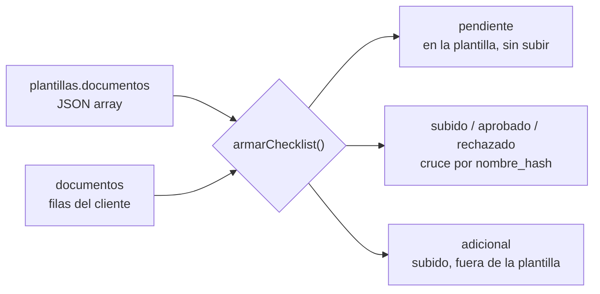
```mermaid
flowchart LR
    A["plantillas.documentos<br/>JSON array"] --> C{"armarChecklist()"}
    B["documentos<br/>filas del cliente"] --> C
    C --> D["pendiente<br/>en la plantilla, sin subir"]
    C --> E["subido / aprobado / rechazado<br/>cruce por nombre_hash"]
    C --> F["adicional<br/>subido, fuera de la plantilla"]
```

Consecuencia útil: editar una plantilla cambia al instante el checklist de todos
sus clientes, sin migrar datos.

---

## 6. Motor de cálculo `motor210`

El corazón técnico del proyecto: **~30 módulos de funciones puras** que
convierten los datos digitados en las casillas del Formulario 210 de la DIAN.

Tres propiedades que definen su diseño:

1. **Puro**: sin `fetch`, sin `localStorage`, sin `Date.now()`. Entra un objeto,
   sale un objeto. Por eso hay 156 pruebas que corren en 1,3 s.
2. **Aislado del servidor**: corre íntegro en el navegador.
3. **Trazable al ET**: cada módulo cita el artículo del Estatuto Tributario que
   implementa; la fundamentación completa está en
   [reglas-tributarias-AG2025.md](reglas-tributarias-AG2025.md).

### Estructura de módulos (UML de componentes)

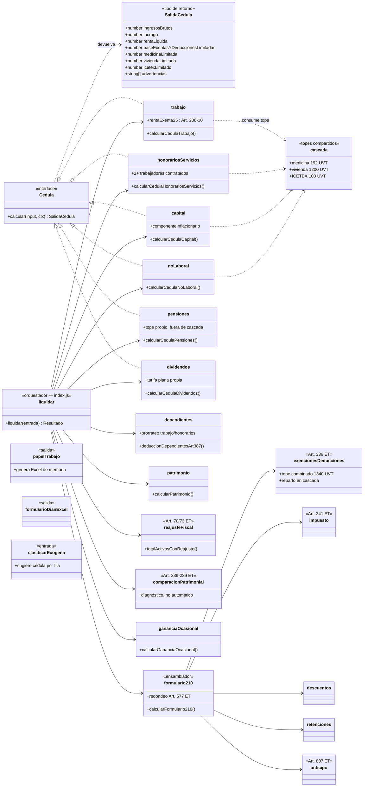
```mermaid
classDiagram
    direction LR

    class liquidar {
        <<orquestador — index.js>>
        +liquidar(entrada) Resultado
    }

    class Cedula {
        <<interface>>
        +calcular(input, ctx) SalidaCedula
    }

    class SalidaCedula {
        <<tipo de retorno>>
        +number ingresosBrutos
        +number incrngo
        +number rentaLiquida
        +number baseExentasYDeduccionesLimitadas
        +number medicinaLimitada
        +number viviendaLimitada
        +number icetexLimitado
        +string[] advertencias
    }

    class trabajo {
        +calcularCedulaTrabajo()
        +rentaExenta25 : Art. 206-10
    }
    class honorariosServicios {
        +calcularCedulaHonorariosServicios()
        +2+ trabajadores contratados
    }
    class capital {
        +calcularCedulaCapital()
        +componenteInflacionario
    }
    class noLaboral {
        +calcularCedulaNoLaboral()
    }
    class pensiones {
        +calcularCedulaPensiones()
        +tope propio, fuera de cascada
    }
    class dividendos {
        +calcularCedulaDividendos()
        +tarifa plana propia
    }

    class cascada {
        <<topes compartidos>>
        +medicina 192 UVT
        +vivienda 1200 UVT
        +ICETEX 100 UVT
    }
    class exencionesDeducciones {
        <<Art. 336 ET>>
        +tope combinado 1340 UVT
        +reparto en cascada
    }
    class dependientes {
        +deduccionDependientesArt387()
        +prorrateo trabajo/honorarios
    }
    class patrimonio {
        +calcularPatrimonio()
    }
    class reajusteFiscal {
        <<Art. 70/73 ET>>
        +totalActivosConReajuste()
    }
    class comparacionPatrimonial {
        <<Art. 236-239 ET>>
        +diagnóstico, no automático
    }
    class gananciaOcasional {
        +calcularGananciaOcasional()
    }
    class impuesto {
        <<Art. 241 ET>>
    }
    class descuentos
    class retenciones
    class anticipo {
        <<Art. 807 ET>>
    }
    class formulario210 {
        <<ensamblador>>
        +calcularFormulario210()
        +redondeo Art. 577 ET
    }

    class papelTrabajo {
        <<salida>>
        +genera Excel de memoria
    }
    class formularioDianExcel {
        <<salida>>
    }
    class clasificarExogena {
        <<entrada>>
        +sugiere cédula por fila
    }

    Cedula <|.. trabajo
    Cedula <|.. honorariosServicios
    Cedula <|.. capital
    Cedula <|.. noLaboral
    Cedula <|.. pensiones
    Cedula <|.. dividendos
    Cedula ..> SalidaCedula : devuelve

    liquidar --> trabajo
    liquidar --> honorariosServicios
    liquidar --> capital
    liquidar --> noLaboral
    liquidar --> pensiones
    liquidar --> dividendos
    liquidar --> dependientes
    liquidar --> patrimonio
    liquidar --> reajusteFiscal
    liquidar --> comparacionPatrimonial
    liquidar --> gananciaOcasional
    liquidar --> formulario210

    trabajo ..> cascada : consume tope
    honorariosServicios ..> cascada
    capital ..> cascada
    noLaboral ..> cascada

    formulario210 --> exencionesDeducciones
    formulario210 --> impuesto
    formulario210 --> descuentos
    formulario210 --> retenciones
    formulario210 --> anticipo
```

### El orden de `liquidar()` no es arbitrario

Hay tres dependencias circulares aparentes que se resuelven con **pasadas
sucesivas**. Este es el punto más delicado del motor:

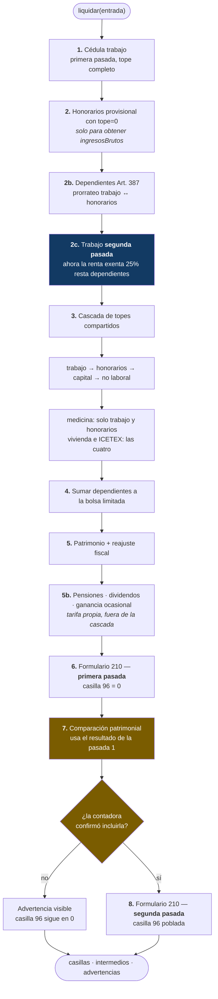
```mermaid
flowchart TD
    START(["liquidar(entrada)"]) --> S1["<b>1.</b> Cédula trabajo<br/>primera pasada, tope completo"]
    S1 --> S2["<b>2.</b> Honorarios provisional con tope=0<br/><i>solo para obtener ingresosBrutos</i>"]
    S2 --> S2B["<b>2b.</b> Dependientes Art. 387<br/>prorrateo trabajo ↔ honorarios"]
    S2B --> S3["<b>2c.</b> Trabajo <b>segunda pasada</b><br/>ahora la renta exenta 25% resta dependientes"]

    S3 --> C1["<b>3.</b> Cascada de topes compartidos"]
    C1 --> C2["trabajo → honorarios → capital → no laboral"]
    C2 --> C3["medicina: solo trabajo y honorarios<br/>vivienda e ICETEX: las cuatro"]

    C3 --> S4["<b>4.</b> Sumar dependientes a la bolsa limitada"]
    S4 --> S5["<b>5.</b> Patrimonio + reajuste fiscal"]
    S5 --> S5B["<b>5b.</b> Pensiones · dividendos · ganancia ocasional<br/><i>tarifa propia, fuera de la cascada</i>"]

    S5B --> S6["<b>6.</b> Formulario 210 — <b>primera pasada</b><br/>casilla 96 = 0"]
    S6 --> S7["<b>7.</b> Comparación patrimonial<br/>usa el resultado de la pasada 1"]
    S7 --> Q{"¿la contadora<br/>confirmó incluirla?"}
    Q -->|no| OUT1["Advertencia visible<br/>casilla 96 sigue en 0"]
    Q -->|sí| S8["<b>8.</b> Formulario 210 — <b>segunda pasada</b><br/>casilla 96 poblada"]
    OUT1 --> FIN(["casillas · intermedios · advertencias"])
    S8 --> FIN

    style S3 fill:#123a63,color:#fff
    style S7 fill:#7a5c00,color:#fff
    style Q fill:#7a5c00,color:#fff
```

Tres reglas que hay que respetar al tocar este archivo:

1. **No redondear antes de `formulario210.js`.** El redondeo a la unidad de mil
   (Art. 577 ET) pasa solo al ensamblar las casillas. Redondear en cada módulo
   acumula diferencias contra el `.xlsm` de referencia de la contadora.
2. **La comparación patrimonial nunca se aplica sola.** Es un diagnóstico que se
   muestra como advertencia; la casilla 96 solo se puebla si la contadora lo
   confirma tras hablar con el cliente. Un ajuste automático aquí tendría
   consecuencias reales frente a la DIAN.
3. **La cascada de topes es un orden, no un conjunto.** Trabajo consume primero;
   lo que sobra baja. Cambiar el orden cambia el resultado.

### `clasificarExogena.js` — deliberadamente conservador

Lee la columna *"Uso declaración Sugerida"* del propio reporte del MUISCA en vez
de mantener a mano una tabla de códigos DIAN que envejece cada año. Lo que no
reconoce con confianza queda en **"sin clasificar"** para digitar a mano:
**nunca adivina**.

> Los exports reales del MUISCA a veces traen el rango `!ref` de la hoja
> dañado. `PasoExogena.jsx` lo recalcula desde las celdas reales antes de
> convertir a filas; sin eso, SheetJS trunca los datos **en silencio**.

---

## 7. Flujos críticos (secuencias)

### 7.1 Login del panel — token sin estado

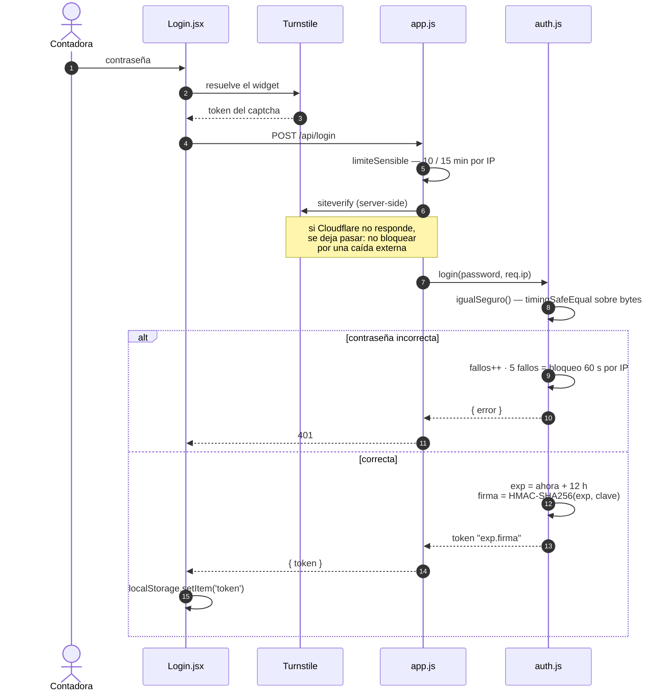
```mermaid
sequenceDiagram
    autonumber
    actor C as Contadora
    participant L as Login.jsx
    participant T as Turnstile
    participant API as app.js
    participant A as auth.js

    C->>L: contraseña
    L->>T: resuelve el widget
    T-->>L: token del captcha
    L->>API: POST /api/login
    API->>API: limiteSensible — 10 / 15 min por IP
    API->>T: siteverify (server-side)
    Note over API,T: si Cloudflare no responde,<br/>se deja pasar: no bloquear<br/>por una caída externa
    API->>A: login(password, req.ip)
    A->>A: igualSeguro() — timingSafeEqual sobre bytes
    alt contraseña incorrecta
        A->>A: fallos++ · 5 fallos = bloqueo 60 s por IP
        A-->>API: { error }
        API-->>L: 401
    else correcta
        A->>A: exp = ahora + 12 h<br/>firma = HMAC-SHA256(exp, clave)
        A-->>API: token "exp.firma"
        API-->>L: { token }
        L->>L: localStorage.setItem('token')
    end
```

**La clave HMAC se deriva de `ADMIN_PASSWORD`.** Cualquier proceso de Passenger
valida el token sin consultar nada compartido — y cambiar la contraseña invalida
todas las sesiones de golpe.

### 7.2 El cliente sube un documento

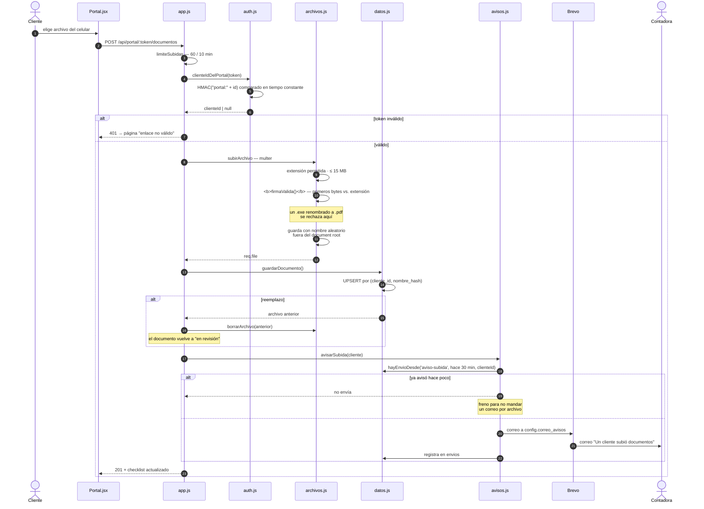
```mermaid
sequenceDiagram
    autonumber
    actor CL as Cliente
    participant P as Portal.jsx
    participant API as app.js
    participant AU as auth.js
    participant AR as archivos.js
    participant D as datos.js
    participant AV as avisos.js
    participant B as Brevo
    actor CO as Contadora

    CL->>P: elige archivo del celular
    P->>API: POST /api/portal/:token/documentos
    API->>API: limiteSubidas — 60 / 10 min
    API->>AU: clienteIdDelPortal(token)
    AU->>AU: HMAC("portal:" + id) comparado en tiempo constante
    AU-->>API: clienteId | null
    alt token inválido
        API-->>P: 401 → página "enlace no válido"
    else válido
        API->>AR: subirArchivo — multer
        AR->>AR: extensión permitida · ≤ 15 MB
        AR->>AR: <b>firmaValida()</b> — primeros bytes vs. extensión
        Note over AR: un .exe renombrado a .pdf<br/>se rechaza aquí
        AR->>AR: guarda con nombre aleatorio<br/>fuera del document root
        AR-->>API: req.file
        API->>D: guardarDocumento()
        D->>D: UPSERT por (cliente_id, nombre_hash)
        alt reemplazo
            D-->>API: archivo anterior
            API->>AR: borrarArchivo(anterior)
            Note over API: el documento vuelve a "en revisión"
        end
        API->>AV: avisarSubida(cliente)
        AV->>D: hayEnvioDesde('aviso-subida', hace 30 min, clienteId)
        alt ya avisó hace poco
            AV-->>API: no envía
            Note over AV: freno para no mandar<br/>un correo por archivo
        else
            AV->>B: correo a config.correo_avisos
            B->>CO: correo "Un cliente subió documentos"
            AV->>D: registra en envios
        end
        API-->>P: 201 + checklist actualizado
    end
```

### 7.3 Alerta diaria de vencimientos — dos disparadores, un solo correo

El problema: Passenger corre N procesos, cada uno con su `setInterval`, **y**
hay un cron externo. El candado no puede vivir en memoria.

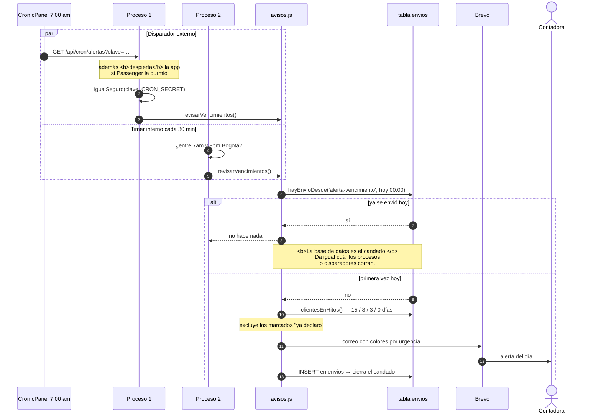
```mermaid
sequenceDiagram
    autonumber
    participant CR as Cron cPanel 7:00 am
    participant P1 as Proceso 1
    participant P2 as Proceso 2
    participant AV as avisos.js
    participant D as tabla envios
    participant B as Brevo
    actor CO as Contadora

    par Disparador externo
        CR->>P1: GET /api/cron/alertas?clave=…
        Note over P1: además <b>despierta</b> la app<br/>si Passenger la durmió
        P1->>P1: igualSeguro(clave, CRON_SECRET)
        P1->>AV: revisarVencimientos()
    and Timer interno cada 30 min
        P2->>P2: ¿entre 7am y 9pm Bogotá?
        P2->>AV: revisarVencimientos()
    end

    AV->>D: hayEnvioDesde('alerta-vencimiento', hoy 00:00)
    alt ya se envió hoy
        D-->>AV: sí
        AV-->>P2: no hace nada
        Note over AV,D: <b>La base de datos es el candado.</b><br/>Da igual cuántos procesos<br/>o disparadores corran.
    else primera vez hoy
        D-->>AV: no
        AV->>D: clientesEnHitos() — 15 / 8 / 3 / 0 días
        Note over AV: excluye los marcados "ya declaró"
        AV->>B: correo con colores por urgencia
        B->>CO: alerta del día
        AV->>D: INSERT en envios → cierra el candado
    end
```

### 7.4 Liquidador 210 — persistencia local-first con sincronía cifrada

El estado del Wizard es grande y sensible. Se guarda en dos sitios con
prioridades distintas: `localStorage` es la **caché rápida y el respaldo
offline**; el servidor es la **fuente compartida entre computadores**.

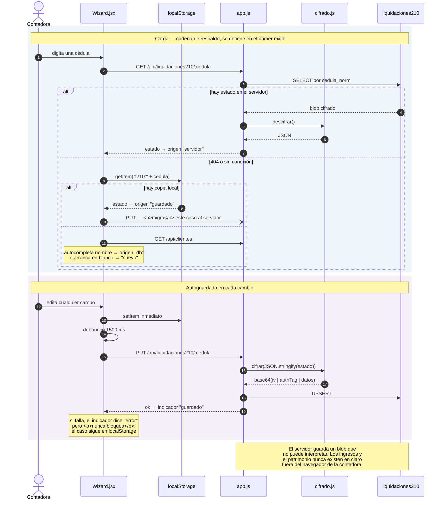
```mermaid
sequenceDiagram
    autonumber
    actor C as Contadora
    participant W as Wizard.jsx
    participant LS as localStorage
    participant API as app.js
    participant CI as cifrado.js
    participant DB as liquidaciones210

    rect rgb(240,245,250)
    Note over C,DB: Carga — cadena de respaldo, se detiene en el primer éxito
    C->>W: digita una cédula
    W->>API: GET /api/liquidaciones210/:cedula
    API->>DB: SELECT por cedula_norm
    alt hay estado en el servidor
        DB-->>API: blob cifrado
        API->>CI: descifrar()
        CI-->>API: JSON
        API-->>W: estado → origen "servidor"
    else 404 o sin conexión
        W->>LS: getItem("f210:" + cedula)
        alt hay copia local
            LS-->>W: estado → origen "guardado"
            W-)API: PUT — <b>migra</b> este caso al servidor
        else
            W->>API: GET /api/clientes
            Note over W: autocompleta nombre → origen "db"<br/>o arranca en blanco → "nuevo"
        end
    end
    end

    rect rgb(245,240,250)
    Note over C,DB: Autoguardado en cada cambio
    C->>W: edita cualquier campo
    W->>LS: setItem inmediato
    W->>W: debounce 1500 ms
    W->>API: PUT /api/liquidaciones210/:cedula
    API->>CI: cifrar(JSON.stringify(estado))
    CI-->>API: base64(iv | authTag | datos)
    API->>DB: UPSERT
    API-->>W: ok → indicador "guardado"
    Note over W: si falla, el indicador dice "error"<br/>pero <b>nunca bloquea</b>:<br/>el caso sigue en localStorage
    end

    Note over API,DB: El servidor guarda un blob que<br/>no puede interpretar. Los ingresos y<br/>el patrimonio nunca existen en claro<br/>fuera del navegador de la contadora.
```

### 7.5 Revisión y notificación de resultado

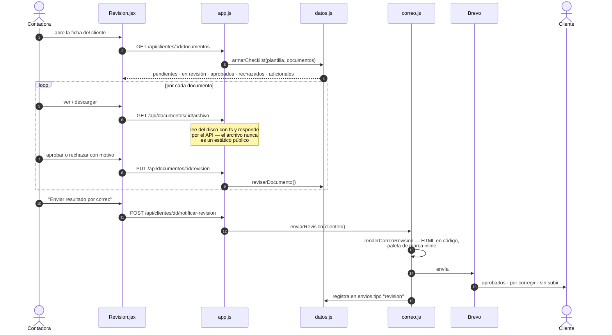
```mermaid
sequenceDiagram
    autonumber
    actor CO as Contadora
    participant R as Revision.jsx
    participant API as app.js
    participant D as datos.js
    participant CR as correo.js
    participant B as Brevo
    actor CL as Cliente

    CO->>R: abre la ficha del cliente
    R->>API: GET /api/clientes/:id/documentos
    API->>D: armarChecklist(plantilla, documentos)
    D-->>R: pendientes · en revisión · aprobados · rechazados · adicionales

    loop por cada documento
        CO->>R: ver / descargar
        R->>API: GET /api/documentos/:id/archivo
        Note over API: lee del disco con fs y responde<br/>por el API — el archivo nunca<br/>es un estático público
        CO->>R: aprobar o rechazar con motivo
        R->>API: PUT /api/documentos/:id/revision
        API->>D: revisarDocumento()
    end

    CO->>R: "Enviar resultado por correo"
    R->>API: POST /api/clientes/:id/notificar-revision
    API->>CR: enviarRevision(clienteId)
    CR->>CR: renderCorreoRevision — HTML en código,<br/>paleta de marca inline
    CR->>B: envía
    B->>CL: aprobados · por corregir · sin subir
    CR->>D: registra en envios tipo "revision"
```

### 7.6 Recuperar el enlace — respuesta anti-enumeración

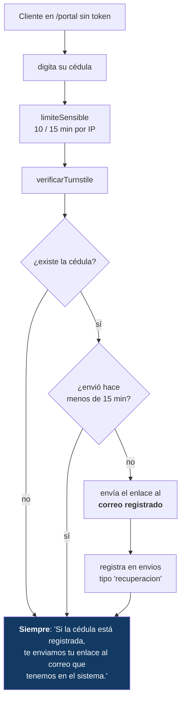
```mermaid
flowchart TD
    A["Cliente en /portal sin token"] --> B["digita su cédula"]
    B --> C["limiteSensible<br/>10 / 15 min por IP"]
    C --> D["verificarTurnstile"]
    D --> E{"¿existe la cédula?"}
    E -->|no| Z["respuesta genérica"]
    E -->|sí| F{"¿envió hace<br/>menos de 15 min?"}
    F -->|sí| Z
    F -->|no| G["envía el enlace al<br/><b>correo registrado</b>"]
    G --> H["registra en envios<br/>tipo 'recuperacion'"]
    H --> Z
    Z["<b>Siempre</b>: 'Si la cédula está registrada,<br/>te enviamos tu enlace al correo que<br/>tenemos en el sistema.'"]

    style Z fill:#123a63,color:#fff
```

Dos propiedades a la vez: nunca confirma si una cédula existe, y **nunca envía a
un correo que el visitante escriba** — solo al que ya está en la base de datos.

---

## 8. Máquinas de estado

### Documento del checklist

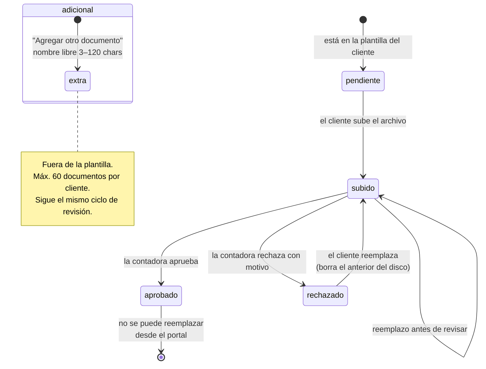
```mermaid
stateDiagram-v2
    [*] --> pendiente : está en la plantilla del cliente

    pendiente --> subido : el cliente sube el archivo
    subido --> aprobado : la contadora aprueba
    subido --> rechazado : la contadora rechaza con motivo
    rechazado --> subido : el cliente reemplaza<br/>(borra el anterior del disco)
    subido --> subido : reemplazo antes de revisar

    aprobado --> [*] : no se puede reemplazar<br/>desde el portal

    state adicional {
        [*] --> extra : "Agregar otro documento"<br/>nombre libre 3–120 chars
        note right of extra
            Fuera de la plantilla.
            Máx. 60 documentos por cliente.
            Sigue el mismo ciclo de revisión.
        end note
    }
```

### Ciclo del cliente en la temporada

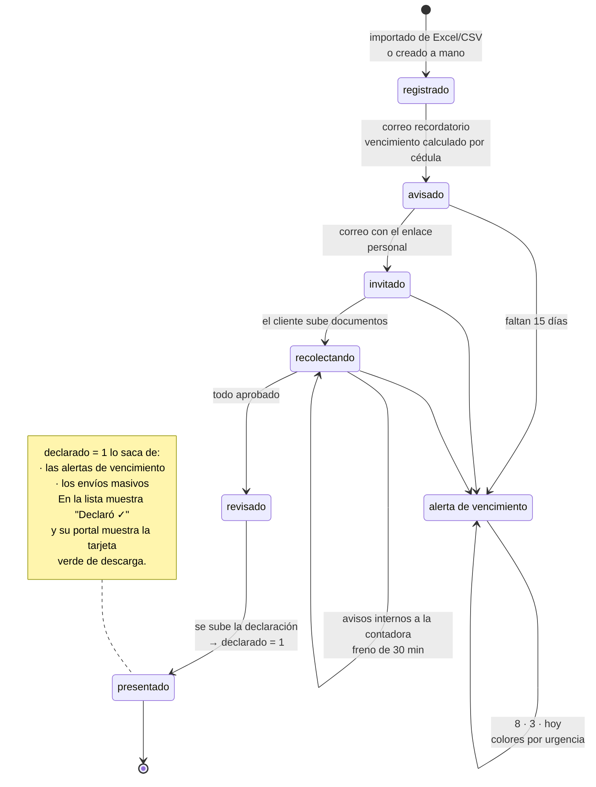
```mermaid
stateDiagram-v2
    [*] --> registrado : importado de Excel/CSV<br/>o creado a mano

    registrado --> avisado : correo recordatorio<br/>vencimiento calculado por cédula
    avisado --> invitado : correo con el enlace personal
    invitado --> recolectando : el cliente sube documentos

    recolectando --> recolectando : avisos internos a la contadora<br/>freno de 30 min
    recolectando --> revisado : todo aprobado
    revisado --> presentado : se sube la declaración<br/>→ declarado = 1

    presentado --> [*]

    note left of presentado
        declarado = 1 lo saca de:
        · las alertas de vencimiento
        · los envíos masivos
        En la lista muestra "Declaró ✓"
        y su portal muestra la tarjeta
        verde de descarga.
    end note

    state "alerta de vencimiento" as alerta
    avisado --> alerta : faltan 15 días
    alerta --> alerta : 8 · 3 · hoy<br/>colores por urgencia
    invitado --> alerta
    recolectando --> alerta
```

---

## 9. Patrones de diseño aplicados

Patrones que están **realmente en el código**, con el archivo donde vive cada
uno y el problema concreto que resuelve.

### Backend

| Patrón | Dónde | Problema que resuelve |
|---|---|---|
| **Arquitectura en capas** | `app.js` → `datos.js` → `db.js` | Cambiar de MySQL a otra base toca un solo archivo |
| **Repository** | `datos.js` | Único lugar con SQL. Los handlers reciben objetos de dominio, no filas |
| **Data Mapper** | `mapCliente`, `mapDocumento`, `mapEntrega`, `mapPlantilla` | Traduce `snake_case` de SQL a `camelCase` de JS y parsea los JSON embebidos |
| **Chain of Responsibility** | Middleware de Express | Cabeceras → rate limit → auth → handler; se corta en el primer rechazo |
| **Decorator** | `ruta(fn)` en `app.js` | Envuelve handlers `async` para que ningún *rejection* tumbe el proceso |
| **Strategy con prioridad** | `correo.js > enviarCorreo()` | Brevo → SMTP → Gmail. En producción solo funciona Brevo; en local, Gmail |
| **Self-contained token** | `auth.js` | Sesiones imposibles: Passenger recicla procesos. El token se valida sin estado compartido |
| **Magic link** | `auth.js > tokenPortal()` | Los clientes no tienen ni recuerdan contraseñas |
| **Idempotent schema migration** | `db.js > init()` | El arranque converge el esquema, sin herramienta ni paso manual de migración |
| **Additive seeding** | `INSERT IGNORE` en `db.js` | Las claves nuevas de `seed.js` llegan a producción sin pisar lo que la usuaria ya editó |
| **Database-backed lock** | `datos.hayEnvioDesde()` | *Dedupe* de avisos entre N procesos sin Redis ni memoria compartida |
| **Fixed-window rate limiter** | `seguridad.js > limitador()` | Fuerza bruta y raspado, sin agregar dependencias |
| **Encryption at rest** | `cifrado.js` | Si la base se filtra, la clave DIAN y las liquidaciones son ilegibles sin `DATA_SECRET` |
| **Content-based validation** | `archivos.js > firmaValida()` | La extensión la falsea cualquiera; los *magic bytes* no |
| **Anti-enumeration response** | `POST /api/portal/recuperar` | Impide usar el formulario como oráculo de cédulas registradas |
| **Fail-open deliberado** | `turnstile.js` | Si Cloudflare cae, no dejar a la usuaria fuera de su propio sistema |

### Frontend

| Patrón | Dónde | Problema que resuelve |
|---|---|---|
| **Functional core / imperative shell** | `motor210/` vs. `vistas/` | La lógica tributaria es pura y testeable; React solo dibuja |
| **Pipeline orchestrator** | `motor210/index.js > liquidar()` | Un único punto que resuelve el orden entre módulos acoplados |
| **Two-pass calculation** | `liquidar()` pasos 2c y 8 | Rompe dependencias circulares reales del formulario |
| **Cascading budget allocation** | `cascada.js` | Topes compartidos que se consumen en un orden normativo |
| **Wizard / multi-step form** | `Wizard.jsx` + 9 `Paso*.jsx` | Un formulario de cientos de campos, digerible por pasos |
| **Local-first + debounced sync** | `Wizard.jsx` | Funciona sin conexión y sincroniza entre computadores sin bloquear nunca |
| **Fallback chain** | `cargarCliente()` | servidor → localStorage → tabla clientes → en blanco |
| **Table-driven config** | `PESTANAS`, `PASOS`, `FILAS_RESUMEN`, `CLAVES_TIPO`, `ENTREGA_TITULOS` | Agregar una pestaña o un paso es agregar una fila |
| **Facade** | `api.js` | Un solo lugar decide qué pasa con el token y con un 401 |
| **Event bus mínimo** | `window` + `'sesion-expirada'` | Logout global sin Context ni Redux |
| **Derived state** | `useMemo` sobre `liquidar()` | El cálculo se rehace en cada render sin recalcular a mano: es aritmética pura y barata |

### Anti-patrones evitados a propósito

- **Sin ORM**: el esquema es pequeño y estable; un ORM añadiría una capa de
  indirección sobre 8 tablas sin ganar nada.
- **Sin gestor de estado global**: ninguna vista necesita el estado de otra. El
  único estado verdaderamente compartido es el token, y vive en `api.js`.
- **Sin framework de CSS**: un `styles.css` con la paleta en `:root` pesa menos
  que cualquier build de Tailwind y no impone otro paso de compilación.
- **Sin router**: cuatro rutas, resueltas con una regex de tres líneas.

---

## 10. Seguridad transversal

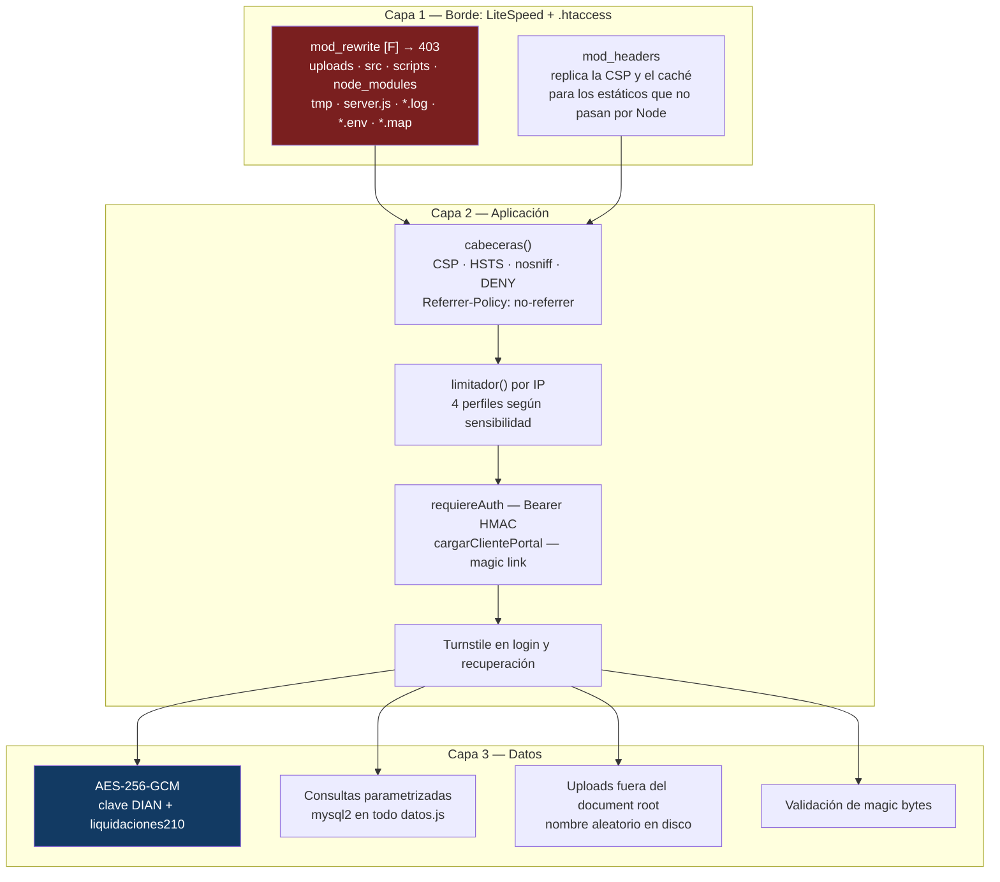
```mermaid
graph TB
    subgraph "Capa 1 — Borde: LiteSpeed + .htaccess"
        L1["mod_rewrite [F] → 403<br/>uploads · src · scripts · node_modules<br/>tmp · server.js · *.log · *.env · *.map"]
        L2["mod_headers<br/>replica la CSP y el caché<br/>para los estáticos que no pasan por Node"]
    end

    subgraph "Capa 2 — Aplicación"
        A1["cabeceras()<br/>CSP · HSTS · nosniff · DENY<br/>Referrer-Policy: no-referrer"]
        A2["limitador() por IP<br/>4 perfiles según sensibilidad"]
        A3["requiereAuth — Bearer HMAC<br/>cargarClientePortal — magic link"]
        A4["Turnstile en login y recuperación"]
    end

    subgraph "Capa 3 — Datos"
        D1["AES-256-GCM<br/>clave DIAN + liquidaciones210"]
        D2["Consultas parametrizadas<br/>mysql2 en todo datos.js"]
        D3["Uploads fuera del document root<br/>nombre aleatorio en disco"]
        D4["Validación de magic bytes"]
    end

    L1 --> A1
    L2 --> A1
    A1 --> A2 --> A3 --> A4
    A4 --> D1
    A4 --> D2
    A4 --> D3
    A4 --> D4

    style L1 fill:#7a1f1f,color:#fff
    style D1 fill:#123a63,color:#fff
```

### Por qué `Referrer-Policy: no-referrer` no es opcional

El enlace del portal lleva el token **en la propia URL**. Sin esta cabecera,
cualquier recurso externo o enlace saliente recibiría el token completo en el
`Referer`. Es la razón por la que la CSP tampoco permite orígenes externos más
allá del widget de Turnstile.

### Los dos secretos y por qué están separados

| Secreto | Firma / cifra | Si se rota |
|---|---|---|
| `ADMIN_PASSWORD` | Token del panel **y** todos los enlaces del portal | Se invalidan todas las sesiones y **todos los enlaces de clientes** |
| `DATA_SECRET` | Clave DIAN y liquidaciones del 210 | **Lo cifrado queda ilegible para siempre.** No rotar |

Están separados a propósito: rotar la contraseña del panel es una operación
razonable de seguridad; perder los datos cifrados no lo es.

---

## 11. Pruebas

```bash
cd client && npm test        # Vitest
```

**156 pruebas en 20 archivos, ~1,3 s.** Todas sobre `motor210` — que es donde un
error tiene consecuencias reales frente a la DIAN.

| Qué se prueba | Cómo |
|---|---|
| Cada cédula por separado | `cedulas/*.test.js` — casos con topes al límite |
| Tablas normativas | `tablaImpuesto241`, `tablaArt73` — valores frontera de cada rango |
| El formulario completo | `formulario210.test.js` · `index.test.js` |
| Contra una declaración real | Cifras de un cliente AG2024 **anonimizadas**, extraídas del `.xlsm` que usaba la contadora |

El motor es puro, así que las pruebas no necesitan mocks, base de datos ni DOM.
Esa es exactamente la razón de haberlo mantenido puro.

**Lo que no está cubierto por pruebas automáticas**: el backend, las vistas de
React y los envíos de correo. Se validan a mano; `GET /api/correos/verificar`
diagnostica el canal de correo sin enviar nada.

> **Gate pendiente antes de usar el Liquidador con clientes reales**: validar
> 2–3 declaraciones de la temporada en paralelo contra el proceso anterior de la
> contadora, casilla por casilla.

---

## 12. Decisiones de arquitectura y sus porqués

Resumen para quien llega nuevo y se pregunta *"¿por qué está hecho así?"*.

| Decisión | Alternativa descartada | Razón |
|---|---|---|
| Autenticación HMAC sin estado | Sesiones en memoria o en Redis | Passenger recicla procesos → daba 401 intermitentes. Redis no existe en este hosting |
| Correo por API HTTPS de Brevo | SMTP | El filtro saliente del proveedor marca el SMTP local como `550 SPAM` y bloquea el SMTP externo |
| Migraciones en el arranque | Herramienta de migraciones | Originalmente, no había shell para correrlas. Se mantiene porque `db.init()` converge el esquema en cada `restart` sin un paso manual que se pueda olvidar |
| Sin ORM | Sequelize / Prisma | 8 tablas estables; el SQL directo es más corto que la configuración del ORM |
| `motor210` en el navegador | Calcular en el servidor | Los datos tributarios del cliente nunca salen del computador de la contadora |
| Liquidaciones cifradas en el servidor | Solo `localStorage` | Poder continuar el mismo caso desde otro computador, sin que el servidor pueda leerlos |
| `envios` como candado | Estado en memoria | Es el único estado compartido entre los procesos de Passenger |
| Uploads fuera del document root | Solo reglas `.htaccess` | El app root **es** el document root: un `.htaccess` regenerado por cPanel expondría los PDFs de clientes. Ahora hay dos candados independientes |
| Despliegue por `scp` + `ssh` | Git pull en el servidor, o CI/CD | El servidor **sí** tiene `git`, así que un `pull` es viable a futuro. Hoy el repo no está clonado allá y el build del frontend se hace en local |
| Fechas en hora de Bogotá | UTC | La usuaria lee el historial directamente; convertir zonas solo introduce confusión |
| `seguridad.js` sin dependencias | `helmet` + `express-rate-limit` | Originalmente, cada dependencia obligaba a subir `node_modules` por SFTP. **Esa restricción ya no existe** (`npm install` corre por SSH); se mantiene porque son ~90 líneas que hacen exactamente lo que se necesita |
| Español en el código | Inglés | Coincide con el dominio: `cedula`, `vencimiento`, `renta exenta` y `cédula general` no tienen traducción útil |

---

## Para empezar a trabajar en el proyecto

```bash
# 1. Base de datos local (MariaDB en podman, 127.0.0.1:3307)
cd server && npm run db:local

# 2. Backend
cp .env.example .env      # editar ADMIN_PASSWORD y el canal de correo
npm install && npm run dev            # http://localhost:3001

# 3. Frontend (otra terminal)
cd client && npm install && npm run dev   # http://localhost:5173

# 4. Pruebas
cd client && npm test
```

### Por dónde entrar según lo que vayas a tocar

| Si vas a… | Empieza leyendo |
|---|---|
| Agregar un endpoint | `server/src/app.js` → `server/src/datos.js` |
| Cambiar el esquema | `server/src/db.js` — patrón de migración con `information_schema` |
| Tocar un cálculo tributario | `docs/reglas-tributarias-AG2025.md` → el módulo en `motor210/` → **su test** |
| Cambiar un correo masivo | `server/src/seed.js` (plantilla) + `client/src/vistas/Correos.jsx` |
| Agregar una pestaña al panel | `client/src/App.jsx > PESTANAS` |
| Agregar un paso al Wizard | `client/src/vistas/liquidador210/Wizard.jsx > PASOS` |
| Entender qué ve el cliente | `client/src/vistas/Portal.jsx` |
| Desplegar | [MANUAL-TECNICO.md §9](MANUAL-TECNICO.md) |
