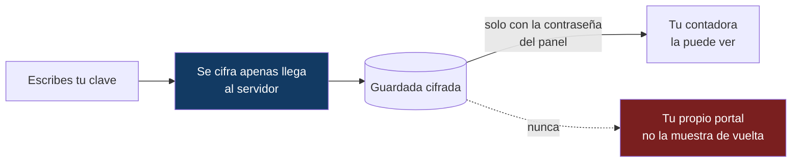
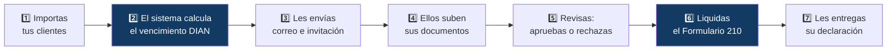
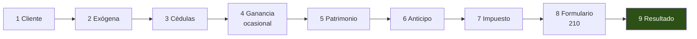

# Manual de usuario — Portal de Declaración de Renta

Guía práctica, sin tecnicismos. Está dividida en dos partes:

- **[Parte 1 — Para el cliente](#parte-1--para-el-cliente)**: cómo entregar los
  documentos de tu declaración de renta desde el celular o el computador.
- **[Parte 2 — Para la contadora](#parte-2--para-la-contadora)**: cómo usar el
  panel de administración completo.

> ¿Buscas la documentación técnica? Está en
> [ARQUITECTURA.md](ARQUITECTURA.md) y [MANUAL-TECNICO.md](MANUAL-TECNICO.md).

---

# Parte 1 — Para el cliente

## ¿Qué es esto?

Un espacio privado en internet donde entregas los documentos que tu contadora
necesita para presentar tu declaración de renta. Reemplaza mandar archivos
sueltos por WhatsApp o correo: aquí ves **exactamente qué falta**, qué ya quedó
aprobado y qué hay que corregir.

**No necesitas crear una cuenta ni recordar ninguna contraseña.**

## Cómo entrar

Recibes un correo con un enlace personal. Ese enlace **es tu llave**: ábrelo y
ya estás adentro.

> **Guárdalo en favoritos** la primera vez. Es el mismo enlace durante toda la
> temporada: puedes entrar y salir las veces que quieras.

### ¿Perdiste el enlace?

Entra a la dirección del portal **sin nada al final** (tu contadora te la puede
recordar) y verás la pantalla **"Recupera tu enlace"**. Escribe tu cédula y te
lo reenviamos.

Por seguridad, **siempre se envía al correo que tu contadora tiene registrado**,
nunca a uno que escribas en ese momento. Si tu correo cambió, avísale a ella
primero.

## Tu lista de documentos

Al entrar ves tus documentos agrupados. El número al lado de cada grupo te dice
cuántos hay:

| Grupo | Qué significa | Qué hacer |
|---|---|---|
| **Necesitan corrección** | Tu contadora los revisó y hay algo mal | Léelo, corrige y sube el archivo otra vez |
| **Por subir** | Todavía no los has enviado | Tócalos y sube el archivo |
| **En revisión** | Ya los subiste, tu contadora los está mirando | Nada, solo esperar |
| **Aprobados** | Listos, no hay que hacer nada más | Nada |

**Empieza siempre por "Necesitan corrección"**: ahí te aparece escrito el motivo
exacto por el que se devolvió.

## Cómo subir un documento

1. Toca el documento de la lista.
2. Elige el archivo, o **toma una foto** directamente con el celular.
3. Listo — pasa solo a **"En revisión"**.

### Qué archivos se aceptan

| Sirven | No sirven |
|---|---|
| PDF | Videos |
| Fotos: JPG, PNG, WebP, HEIC (iPhone) | Archivos comprimidos ZIP o RAR |
| Word y Excel: doc, docx, xls, xlsx | Archivos de más de **15 MB** |

**Si te sale error al subir**, casi siempre es una de dos cosas: el archivo pesa
más de 15 MB, o es de un tipo que no está en la lista. Una foto tomada con el
celular normalmente pesa entre 2 y 5 MB, así que va bien.

### Consejos para las fotos

- Que se lea **todo** el documento, sin bordes cortados.
- Buena luz, sin sombra encima ni reflejo del flash.
- Si el documento tiene varias páginas, **súbelas una por una** o únelas en un
  solo PDF.

### ¿Te equivocaste de archivo?

Súbelo otra vez sobre el mismo documento: el anterior se reemplaza y vuelve a
quedar "En revisión".

La única excepción son los documentos **ya aprobados**: esos quedan cerrados. Si
necesitas cambiar uno aprobado, escríbele a tu contadora.

## Tienes un documento que no está en la lista

Muy común: dos certificados de deuda, tres cuentas bancarias, un soporte extra.

Usa el botón **"Agregar otro documento"** al final de la página, ponle un nombre
que se entienda (por ejemplo *"Certificado de deuda Bancolombia"*) y súbelo. Se
marca con la etiqueta **"Adicional"** para que tu contadora sepa que viene por
fuera de la lista original.

## Tu clave de acceso a la DIAN

En tu portal hay una tarjeta con un candado: **"Clave de acceso a la DIAN"** —
la misma con la que entras a la página de la DIAN. Tu contadora la necesita para
presentar la declaración a tu nombre.

**Cómo se protege:**

Fíjate en el detalle importante: **ni tu propio portal te la muestra de vuelta.**
Aunque alguien consiguiera tu enlace, no podría leer tu clave. Solo tu contadora,
entrando con su contraseña, puede verla.

Y cuando ya presentó tu declaración, ella puede borrarla del sistema.

> Si en algún momento cambias tu clave en la DIAN, actualízala aquí con el botón
> **"Actualizar clave"**.

## Mantener tus datos al día

Toca el **lápiz** junto a tu nombre para corregir tu **correo** y tu
**celular**. Es importante: si tu correo está mal, no te llegan ni los
recordatorios ni el enlace cuando lo pidas.

Tu nombre y tu cédula solo los puede cambiar tu contadora — avísale si hay un
error ahí.

## Cuando tu declaración esté lista

Aparece una **tarjeta verde** en tu portal con el botón **"Descargar mi
declaración"**. Ahí también quedan, cuando aplican, el anexo y el recibo de pago.

> **Descárgalos y guárdalos.** Son tus soportes ante la DIAN y te los pueden
> pedir después.

## Preguntas frecuentes

**¿Alguien más puede ver mis documentos?**
No. Tus archivos no están publicados en internet: solo salen del servidor para
ti (con tu enlace) y para tu contadora (con su contraseña).

**¿Puedo entrar desde el celular?**
Sí. El portal está diseñado para el celular primero.

**¿Y si comparto mi enlace por error?**
Avísale a tu contadora. Tu clave DIAN sigue protegida de todas formas —el portal
no la muestra—, pero quien tenga el enlace podría ver tu lista de documentos.

**¿El enlace se vence?**
No. Dura toda la temporada.

**No me llegó ningún correo.**
Revisa la carpeta de spam o correo no deseado. Si no está ahí, escríbele a tu
contadora: puede que el correo registrado esté mal escrito.

---

# Parte 2 — Para la contadora

## Qué hace el sistema

Todo pasa en un solo lugar. El sistema te avisa por correo cuando alguien sube
algo y cuando se acercan vencimientos: **no tienes que estar revisando.**

## Entrar al panel

Abre la dirección del sistema y escribe tu contraseña. La sesión dura **12
horas**; después vuelve a pedirla.

Tras 5 intentos fallidos el sistema bloquea un minuto — es protección contra
robots, no un error tuyo.

> La primera vez se abre sola una **guía de los módulos**. Puedes reabrirla
> cuando quieras con el botón **?** de la barra superior.

En el celular, el menú de pestañas se abre con el botón **☰**.

---

## Pestaña Clientes

Tu lista de trabajo.

### Importar desde Excel o CSV

Botón **"Importar Excel/CSV"**. Las columnas que reconoce son **Nombre**,
**Cédula**, **Correo** y **Teléfono** — no importa el orden.

Puedes importar el mismo archivo dos veces sin miedo: los clientes se identifican
por la cédula, así que **no se duplican** (se actualizan los datos).

### La fecha de vencimiento se calcula sola

No la escribes: el sistema toma los **dos últimos dígitos** de la cédula y busca
la fecha en el Calendario DIAN.

La columna **Vence** se pinta según la urgencia:

| Color | Faltan | |
|---|---|---|
| Sin color | Más de 15 días | Tranquila |
| Amarillo | 15 días o menos | Ojo |
| Naranja | 8 días o menos | Hay que moverse |
| Rojo | 3 días o menos | Urgente |
| Rojo pleno | **Vence hoy** | Es el último día |
| "Declaró ✓" | Ya presentó | Fuera de alertas |

### Otras acciones

- **Buscador**: por nombre, correo o cédula.
- **Editar**: corrige datos, cambia la lista de documentos asignada, o marca
  **"ya declaró"**.
- **Último envío**: cuándo le escribiste por última vez.

> **Marcar "ya declaró"** saca al cliente de las alertas de vencimiento y de
> los envíos masivos. Se marca **solo** cuando subes su declaración desde
> Revisión, pero también puedes hacerlo a mano.

---

## Pestaña Correos

Tres mensajes masivos, cada uno con su plantilla editable:

| Mensaje | Para qué | Cuándo enviarlo |
|---|---|---|
| **Recordatorio** | Avisa el vencimiento con la lista de documentos | Al arrancar la temporada |
| **Invitación al portal** | Manda el enlace personal | Junto con el recordatorio o después |
| **Novedades del portal** | Explica todo lo que el cliente puede hacer allí | Si agregaste funciones nuevas |

### Cómo enviar

1. Elige el mensaje arriba.
2. Selecciona los clientes (o marca **"solo los que no han recibido"**).
3. **Vista previa** con un cliente real — se ve tal como le llegará.
4. Enviar.

El sistema **omite automáticamente** a quien no tenga correo, no tenga lista de
documentos asignada, no tenga fecha de vencimiento, o ya esté marcado como
declarado. Te avisa a cuáles saltó y por qué.

### Editar las plantillas

Puedes cambiar el asunto y el cuerpo de cada mensaje. Escribe estas palabras
entre llaves y se reemplazan solas por los datos de cada cliente:

| Escribe | Sale |
|---|---|
| `{{nombre}}` | El nombre del cliente |
| `{{vencimiento}}` | Su fecha de vencimiento |
| `{{digitos}}` | Los dos últimos dígitos de su cédula |
| `{{documentos}}` | Su lista completa de documentos |
| `{{portal}}` | Su enlace personal |
| `{{recuperar}}` | La página de "recuperar mi enlace" |
| `{{remitente}}` | Tu firma |

### Avisos internos

Abajo de todo configuras **a qué correo tuyo** te llegan los avisos automáticos:

- **Cuando un cliente sube documentos** — con un freno de 30 minutos, para que
  no te llegue un correo por cada archivo.
- **Alerta diaria de vencimientos** — quiénes llegan a los 15, 8, 3 días o
  vencen hoy, con colores por urgencia. Llega **una sola vez al día**.

> Si dejas el campo vacío, los avisos se apagan.

### Historial

Todo lo enviado queda registrado con fecha, destinatario, tipo y si salió bien o
falló. Ahí también ves los avisos internos y los reenvíos de enlace.

---

## Pestaña Revisión

El día a día de la temporada.

A la izquierda, tus clientes con un contador de documentos **por revisar**.
Empieza por los que tienen número.

### Revisar cada documento

Botones **Ver** (lo abres) → **Aprobar** o **Rechazar**.

> **Al rechazar, escribe el motivo con detalle.** El cliente lo lee tal cual en
> su portal. *"La foto está cortada, falta la parte de abajo"* le sirve;
> *"mal"* lo deja igual de perdido.

¿Te equivocaste? **Deshacer** devuelve el documento a "por revisar".

Los documentos que el cliente subió por su cuenta aparecen marcados
**"Adicional"**.

### Avisarle el resultado

Cuando termines de revisar a un cliente: botón **"Enviar resultado por correo"**.
Le llega un mensaje ordenado con tres listas: qué quedó aprobado, qué debe
corregir (con tus motivos) y qué falta por subir.

### Su clave DIAN

Si el cliente la registró, aparece la tarjeta **"Clave DIAN"** con tres botones:

- **Ver** / **Ocultar** — la muestra en pantalla
- **Copiar** — al portapapeles, para pegarla en la DIAN
- **Borrar** — la elimina del sistema

> **Bórrala cuando ya presentaste la declaración.** Es el dato más sensible que
> guarda el sistema; si no está, no hay nada que proteger.

### Copiar el enlace del cliente

Botón **"Copiar enlace del portal"** — útil para mandárselo por WhatsApp cuando
no le llega el correo.

### Entregarle sus documentos finales

Sección **"Documentos para el cliente"**, con tres espacios:

| Tipo | Qué es |
|---|---|
| **Declaración** | El formulario presentado ante la DIAN |
| **Anexo** | El anexo de renta |
| **Recibo** | El recibo de pago |

Subes cada uno con **Subir** (o **Reemplazar** si ya había uno) y el cliente lo
ve al instante en su portal.

> **Subir la declaración marca al cliente como "ya declaró" automáticamente.**
> Sale de las alertas de vencimiento y le aparece la tarjeta verde de descarga.

---

## Pestaña Documentos

Aquí defines las **listas de documentos por perfil**: empleado, independiente,
con inversiones, etc.

Lo que escribas aquí es lo que ve el cliente en su correo **y** en su portal, así
que escribe los nombres como se los dirías a él: *"Certificado de ingresos y
retenciones 2025"*, no *"Cert. ing. y ret."*.

> Editar una lista actualiza al instante el portal de **todos** los clientes
> que la tengan asignada. Si agregas un documento a mitad de temporada, a todos
> les aparece como "por subir".

---

## Pestaña Calendario DIAN

Los vencimientos por pares de dígitos. **Ya viene cargado** con el calendario
oficial (año gravable 2025: del 12 de agosto al 26 de octubre de 2026).

Solo tienes que tocarlo si la DIAN mueve fechas. Recuerda **Guardar cambios**.

> Verifica siempre contra el
> [calendario oficial de la DIAN](https://www.dian.gov.co/Calendarios/Calendario_Tributario_2026.pdf).
> De esta tabla salen todas las fechas y todas las alertas del sistema.

---

## Pestaña Liquidador 210

Un asistente que arma el borrador del **Formulario 210** paso a paso. Reemplaza
el archivo de Excel que usabas antes.

### Cómo funciona

Escribe la cédula del cliente y el asistente busca en este orden: primero una
liquidación ya guardada en el servidor, después una en este computador, después
sus datos en tu lista de clientes. Si no hay nada, arranca en blanco.

Los 9 pasos:

- **Cliente** — datos de identificación.
- **Exógena** — cargas el reporte del MUISCA y lo consultas mientras digitas. Es
  un **visor**: el sistema no clasifica por ti, igual que el Excel de antes.
- **Cédulas** — trabajo, honorarios y servicios, capital y no laboral. Se llenan
  **todas las que apliquen** al mismo cliente: un asalariado con ingresos
  independientes usa dos.
- **Ganancia ocasional**, **Patrimonio**, **Anticipo**, **Impuesto** — cada uno
  con sus campos y los topes de ley aplicados solos.
- **Formulario 210** — todas las casillas armadas.
- **Resultado** — el resumen y las descargas.

### Se guarda solo

No hay botón de guardar. Cada cambio se guarda **en este computador al instante**
y **en el servidor** un segundo después. El indicador arriba te dice cómo va:
*guardando… / guardado / error*.

Como también queda en el servidor, **puedes seguir la misma declaración desde
otro computador**. Y si se cae internet, sigues trabajando: queda en este
navegador y sube después.

> Todo lo que digitas aquí — ingresos, patrimonio, exógena — **se calcula en
> tu propio navegador**. El servidor solo guarda una copia cifrada que no puede
> leer.

### Las advertencias sí hay que leerlas

Arriba del resultado aparecen advertencias en amarillo. **No son adorno**: marcan
topes al límite, datos que faltan o cifras que conviene revisar antes de
presentar.

La más importante es la **comparación patrimonial** (Art. 236-239 ET): si el
patrimonio creció más de lo que la renta declarada explica, el sistema te lo
dice y calcula la diferencia — pero **no la aplica solo**. Verifica con el
cliente si hay activos omitidos o pasivos inexistentes, y solo entonces confirma
si se incluye.

### Descargas

| Descarga | Para qué |
|---|---|
| **Papel de trabajo** (Excel) | Tu memoria de cálculo: de dónde salió cada cifra |
| **Formulario 210** (Excel) | Casilla por casilla, para pasarlo al MUISCA |
| **Anexos** (PDF) | Documento presentable para entregarle al cliente |

> **Antes de usarlo con clientes reales**, liquida 2 o 3 declaraciones **en
> paralelo** con tu método anterior y compara casilla por casilla. Un error de
> cálculo tiene consecuencias reales frente a la DIAN.

---

## Cuando algo no sale bien

| Lo que ves | Qué pasó | Qué hacer |
|---|---|---|
| **"Sesión expirada"** | Pasaron las 12 horas | Vuelve a entrar. No se pierde nada |
| **"Demasiados intentos"** | Protección anti-robots | Espera un minuto |
| Un correo falló en el historial | El correo del cliente está mal, o se acabó el cupo diario | Revisa la dirección; el plan gratis son 300 correos/día |
| No llegan los avisos internos | Falta configurar el correo | Correos → Avisos internos |
| El cliente dice que no le llega nada | Spam, o correo mal escrito | Verifica el correo y usa **"Copiar enlace del portal"** |
| El Liquidador dice "error" al guardar | Sin conexión al servidor | Sigue trabajando: queda en este computador y sube después |
| Un cliente no aparece al enviar correos | Le falta correo, lista de documentos o fecha; o está marcado como declarado | El sistema te dice cuál es el motivo |

### Reglas de oro

1. **La contraseña del panel abre todo.** Si la cambias, se invalidan **todos**
   los enlaces de tus clientes y hay que reenviarlos. No la cambies a mitad de
   temporada sin necesidad.
2. **Borra las claves DIAN** cuando ya presentaste.
3. **Marca "ya declaró"** o sube la declaración: así el sistema deja de
   perseguirte con alertas de ese cliente.
4. **Verifica el calendario** al inicio de cada temporada.
