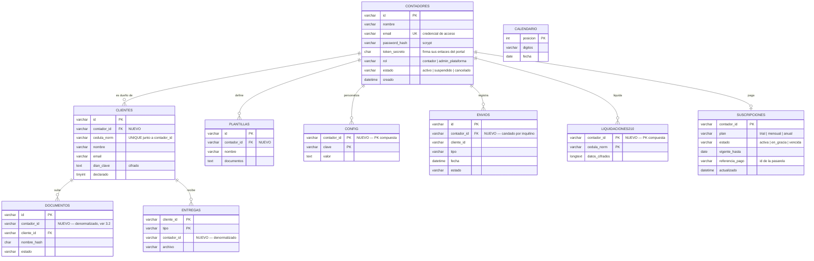
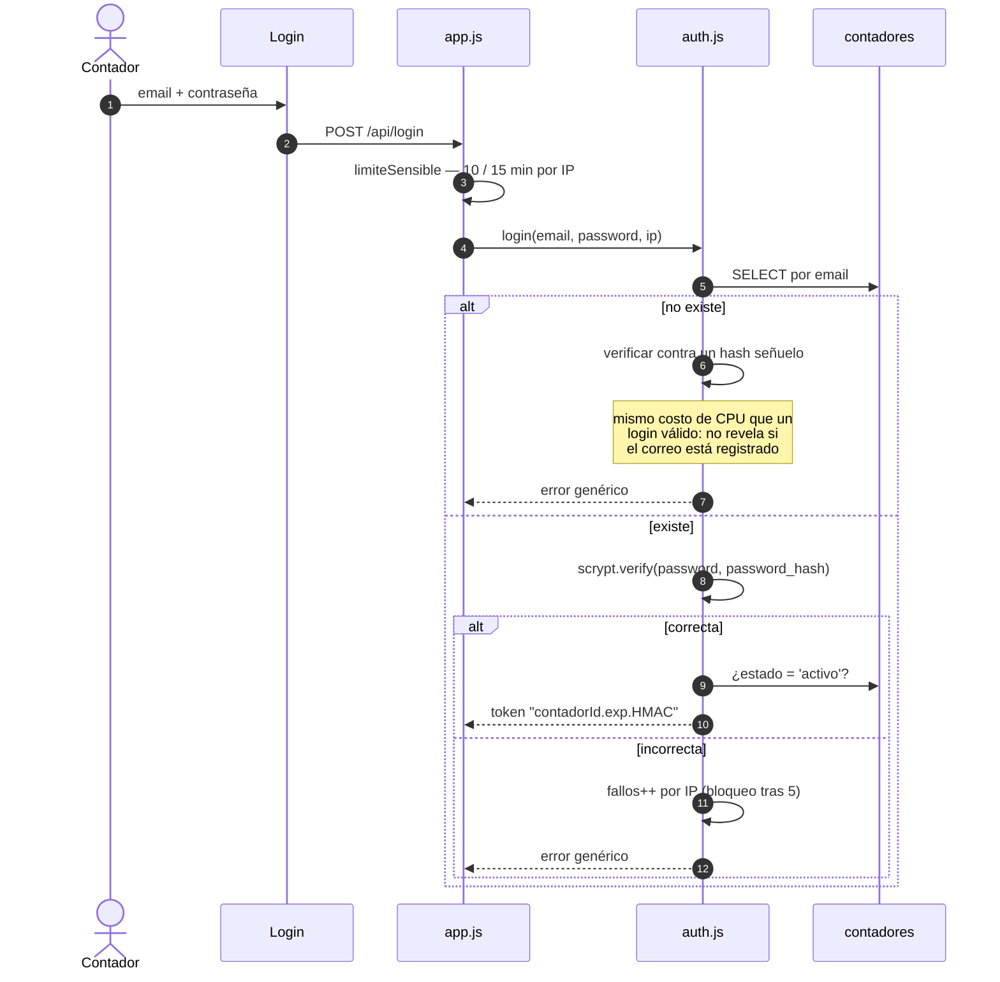
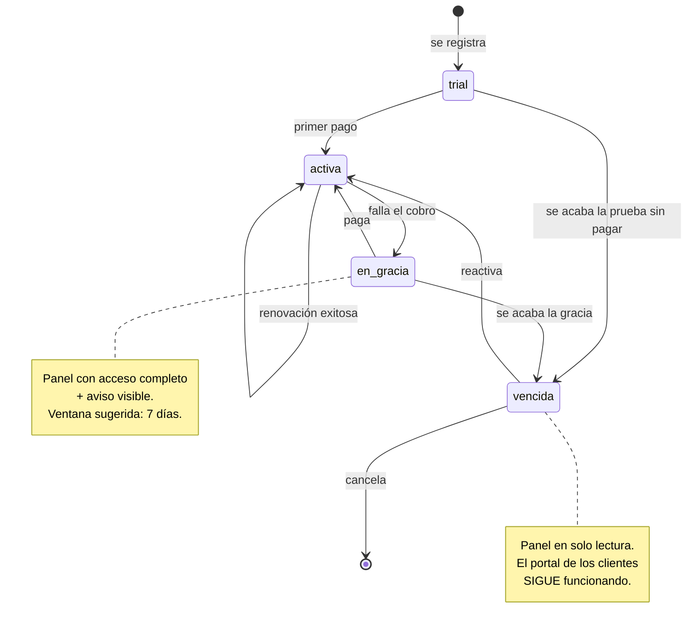
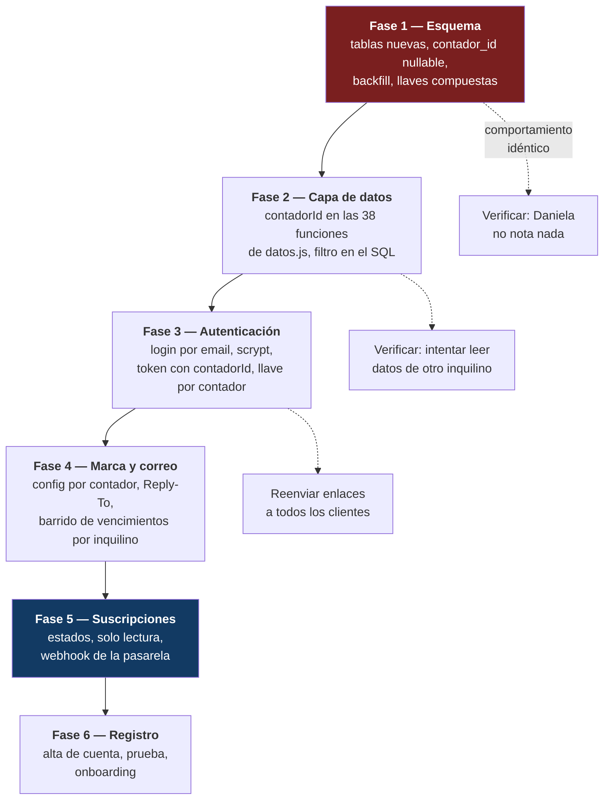

# Plan de migración a multi-tenant

Cómo pasar de **una contadora** a **varios contadores, cada uno con sus propios
clientes y su propia suscripción**, sobre la infraestructura actual (cPanel +
MySQL) y sin migrar de plataforma.

> **Estado: diseñado, no implementado.** Es un plan para ejecutar cuando se
> retome; nada de esto está en el código. La decisión vigente es terminar
> primero el gate de validación del Liquidador 210 con casos reales.

- Arquitectura actual: [ARQUITECTURA.md](ARQUITECTURA.md)
- Referencia de endpoints y esquema: [MANUAL-TECNICO.md](MANUAL-TECNICO.md)

---

## Índice

1. [Por qué hoy no es multi-tenant](#1-por-qué-hoy-no-es-multi-tenant)
2. [Los tres riesgos que hay que cerrar](#2-los-tres-riesgos-que-hay-que-cerrar)
3. [Decisiones de diseño](#3-decisiones-de-diseño)
4. [Modelo de datos objetivo](#4-modelo-de-datos-objetivo)
5. [Migraciones de esquema](#5-migraciones-de-esquema)
6. [Autenticación y tokens](#6-autenticación-y-tokens)
7. [Aislamiento en la capa de datos](#7-aislamiento-en-la-capa-de-datos)
8. [Correo y marca por contador](#8-correo-y-marca-por-contador)
9. [Suscripciones](#9-suscripciones)
10. [Orden de ejecución](#10-orden-de-ejecución)
11. [Checklist de verificación](#11-checklist-de-verificación)
12. [Lo que no cambia](#12-lo-que-no-cambia)

---

## 1. Por qué hoy no es multi-tenant

Verificado contra el esquema y el código:

| Evidencia | Implicación |
|---|---|
| No existe tabla de usuarios — solo `clientes`, `plantillas`, `calendario`, `config`, `envios`, `entregas`, `documentos`, `liquidaciones210` | El "contador" no existe como entidad |
| Ninguna tabla tiene columna de dueño (0 ocurrencias de `contador_id`/`tenant`/`usuario_id`) | Todos los datos viven en un espacio compartido |
| `ADMIN_PASSWORD` **es** la identidad (`auth.js`) | Una contraseña = una persona |
| `config` es clave→valor global (`remitente`, `correo_avisos`, plantillas) | Una sola marca y un solo destino de avisos |
| `FROM_EMAIL` / `REPLY_TO` salen del `.env` | Todos los correos tendrían el mismo remitente |
| Los enlaces del portal se firman con una llave derivada de `ADMIN_PASSWORD` | Sin llave por contador, el token de uno serviría para los clientes de otro |

**Alcance del cambio** (medido): 45 consultas SQL y 38 funciones exportadas en
`datos.js`, más 15 rutas del panel que reciben un identificador.

---

## 2. Los tres riesgos que hay que cerrar

Hoy son inofensivos porque hay un solo inquilino. **El día que entre el
segundo, los tres se vuelven fallos reales** — y dos de ellos fallan en
silencio, que es lo peligroso.

### 2.1 La cédula es única a nivel global

```sql
UNIQUE KEY uq_cedula_norm (cedula_norm)   -- clientes
cedula_norm VARCHAR(50) PRIMARY KEY       -- liquidaciones210
```

El primer contador que registre a una persona **bloquea al segundo**. Y en
Colombia es normal que alguien cambie de contador o que dos compartan un
cliente.

Peor en `liquidaciones210`, donde la cédula es la llave primaria: dos
contadores liquidando a la misma persona **se sobrescribirían la declaración
entre ellos**, sin error visible.

→ Las llaves deben pasar a `(contador_id, cedula_norm)`.

### 2.2 Acceso a recursos por id sin verificar dueño (IDOR)

```js
// datos.js
async function obtenerDocumento(id) {
  return q('SELECT * FROM documentos WHERE id = ?', [id]);  // sin filtro de dueño
}
```

`GET /api/documentos/:id/archivo` entrega el archivo con solo conocer el id.
En multi-tenant, un contador autenticado podría **descargar documentos de los
clientes de otro**. La misma clase de fallo aplica a las 15 rutas que reciben
`:id`, `:clienteId` o `:cedula`, y las más graves son:

| Ruta | Qué expondría |
|---|---|
| `GET /api/documentos/:id/archivo` | Soportes tributarios de un cliente ajeno |
| `GET /api/clientes/:id/dian` | **La clave DIAN descifrada** de un cliente ajeno |
| `GET /api/liquidaciones210/:cedula` | La declaración completa de otro contador, buscando por cédula |
| `GET /api/clientes/:id/entrega/:tipo` | La declaración presentada de un cliente ajeno |

`GET /api/liquidaciones210/:cedula` es la más expuesta: no hace falta adivinar
un id aleatorio, basta escribir una cédula.

→ Toda lectura por identificador debe filtrar por `contador_id` **en el SQL**,
no en el handler.

### 2.3 El candado de la alerta diaria es global

```js
// avisos.js:156
if (await datos.hayEnvioDesde('alerta-vencimiento', `${hoy} 00:00:00`)) return;
```

`hayEnvioDesde` sin `clienteId` cuenta filas de **toda** la tabla `envios`. Con
varios contadores, el primero en recibir su alerta del día **suprime la de
todos los demás** hasta mañana. Nadie recibe error: simplemente no llega el
correo.

→ El candado debe ser por contador: `hayEnvioDesde(tipo, desde, {contadorId})`.

---

## 3. Decisiones de diseño

Cada una con la recomendación y el porqué. Son las que conviene cerrar **antes**
de escribir código.

### 3.1 Estrategia de aislamiento: columna, no base por cliente

| Opción | Veredicto |
|---|---|
| **Columna `contador_id`** (discriminador) | **Recomendada.** Aditiva, una sola base, migraciones simples, cabe en el hosting actual |
| Base de datos por contador | Descartada: cPanel limita bases y conexiones por cuenta; el pool ya está en `connectionLimit: 4` |
| Esquema por contador | Descartada: mismo problema, más complejidad operativa |

### 3.2 Qué se aísla y qué se comparte

| Tabla | Ámbito | Razón |
|---|---|---|
| `clientes` | Por contador | Es el núcleo del aislamiento |
| `plantillas` | Por contador | Cada uno arma sus listas de documentos |
| `config` | Por contador | Marca, firma, plantillas de correo, `correo_avisos` |
| `envios` | Por contador | Historial propio **y** candado de avisos (§2.3) |
| `liquidaciones210` | Por contador | Ver §2.1 |
| `documentos`, `entregas` | Por contador (**denormalizado**) | Se llega a ellas por `cliente_id`, pero ver la nota de abajo |
| `calendario` | **Global** | Es el calendario oficial de la DIAN: el mismo hecho para todos |
| `contadores`, `suscripciones` | Globales (nuevas) | Son la tabla de inquilinos |

> **Nota sobre `documentos` y `entregas`.** En teoría no necesitan
> `contador_id`: se alcanzan vía `cliente_id`, que ya está aislado. En la
> práctica **conviene denormalizarlo igual**, porque el fallo de §2.2 nace
> justamente de consultar por id sin pasar por `clientes`. Con la columna
> presente, el filtro se puede aplicar siempre y un `JOIN` olvidado deja de ser
> una fuga. Cuesta dos columnas y evita una clase entera de errores.

### 3.3 El calendario DIAN pasa a ser de solo lectura

Hoy cualquiera lo edita desde el panel. Al ser global, **un contador editándolo
se lo cambiaría a todos**.

Recomendación: mantenerlo global y mover su edición a un rol de
**administrador de plataforma**. Es un hecho objetivo publicado por la DIAN, no
una preferencia de cada contador. La pestaña queda visible pero sin guardar,
con una nota de a quién escribir si la DIAN mueve fechas.

### 3.4 Contraseñas: `scrypt` del propio Node

`crypto.scrypt` viene en Node — **sin dependencias nuevas**, coherente con la
política del proyecto. No usar SHA plano ni el patrón actual de comparar
contra una variable de entorno.

### 3.5 Llave de firma propia por contador

Cada contador lleva un `token_secreto` aleatorio con el que se firman **sus**
enlaces del portal. Dos beneficios:

1. El token de un contador no sirve para los clientes de otro.
2. **Se arregla un dolor que ya existe hoy**: actualmente cambiar
   `ADMIN_PASSWORD` invalida todos los enlaces de todos los clientes. Con llave
   independiente, cambiar la contraseña deja de romper los enlaces.

### 3.6 Cifrado: una sola llave de servidor

`DATA_SECRET` sigue siendo una llave del servidor, no una por contador. El
servidor necesita poder descifrar de todas formas, así que una llave por
inquilino agregaría gestión de llaves sin ganar aislamiento real. Lo que sí
cambia: el **acceso** a lo descifrado se filtra por `contador_id`.

---

## 4. Modelo de datos objetivo



`CALENDARIO` queda deliberadamente sin relación: es referencia global (§3.3).

---

## 5. Migraciones de esquema

Siguen el patrón existente de `db.js > init()`: consultar `information_schema`
y aplicar el `ALTER` solo si falta. **Idempotentes y en este orden.**

### Paso 1 — Crear las tablas nuevas

```sql
CREATE TABLE IF NOT EXISTS contadores (
  id VARCHAR(20) PRIMARY KEY,
  nombre VARCHAR(255) NOT NULL,
  email VARCHAR(255) NOT NULL,
  password_hash VARCHAR(255) NOT NULL,
  token_secreto CHAR(64) NOT NULL,
  rol VARCHAR(20) NOT NULL DEFAULT 'contador',
  estado VARCHAR(20) NOT NULL DEFAULT 'activo',
  creado DATETIME NOT NULL,
  UNIQUE KEY uq_email (email)
) CHARACTER SET utf8mb4 COLLATE utf8mb4_unicode_ci;

CREATE TABLE IF NOT EXISTS suscripciones (
  contador_id VARCHAR(20) PRIMARY KEY,
  plan VARCHAR(20) NOT NULL DEFAULT 'trial',
  estado VARCHAR(20) NOT NULL DEFAULT 'activa',
  vigente_hasta DATE NULL,
  referencia_pago VARCHAR(100) NULL,
  actualizado DATETIME NOT NULL
) CHARACTER SET utf8mb4 COLLATE utf8mb4_unicode_ci;
```

### Paso 2 — Crear el contador actual a partir del `.env`

Antes de tocar las tablas existentes, sembrar **la cuenta de la contadora
actual** con un id fijo y conocido, para poder rellenar con él:

```sql
INSERT IGNORE INTO contadores (id, nombre, email, password_hash, token_secreto, rol, estado, creado)
VALUES ('c0000000000000000001', 'Daniela', ?, ?, ?, 'contador', 'activo', ?);
```

El `password_hash` se deriva **una sola vez** del `ADMIN_PASSWORD` vigente, así
la migración no le cambia la contraseña a nadie.

### Paso 3 — Agregar columnas con valor por defecto

Cada columna entra **nullable**, se rellena, y recién después se marca
`NOT NULL`. Así la migración es segura aunque se interrumpa a la mitad.

```sql
ALTER TABLE clientes         ADD COLUMN contador_id VARCHAR(20) NULL;
ALTER TABLE plantillas       ADD COLUMN contador_id VARCHAR(20) NULL;
ALTER TABLE envios           ADD COLUMN contador_id VARCHAR(20) NULL;
ALTER TABLE documentos       ADD COLUMN contador_id VARCHAR(20) NULL;
ALTER TABLE entregas         ADD COLUMN contador_id VARCHAR(20) NULL;

UPDATE clientes   SET contador_id = 'c0000000000000000001' WHERE contador_id IS NULL;
UPDATE plantillas SET contador_id = 'c0000000000000000001' WHERE contador_id IS NULL;
UPDATE envios     SET contador_id = 'c0000000000000000001' WHERE contador_id IS NULL;
UPDATE documentos SET contador_id = 'c0000000000000000001' WHERE contador_id IS NULL;
UPDATE entregas   SET contador_id = 'c0000000000000000001' WHERE contador_id IS NULL;

ALTER TABLE clientes   MODIFY contador_id VARCHAR(20) NOT NULL;
-- (igual para las demás)
```

### Paso 4 — Cambiar las llaves (el paso delicado)

```sql
-- clientes: la cédula deja de ser única globalmente
ALTER TABLE clientes
  DROP INDEX uq_cedula_norm,
  ADD UNIQUE KEY uq_contador_cedula (contador_id, cedula_norm);

-- config: PK compuesta
ALTER TABLE config
  ADD COLUMN contador_id VARCHAR(20) NOT NULL DEFAULT 'c0000000000000000001',
  DROP PRIMARY KEY,
  ADD PRIMARY KEY (contador_id, clave);

-- liquidaciones210: PK compuesta
ALTER TABLE liquidaciones210
  ADD COLUMN contador_id VARCHAR(20) NOT NULL DEFAULT 'c0000000000000000001',
  DROP PRIMARY KEY,
  ADD PRIMARY KEY (contador_id, cedula_norm);

-- índices de consulta
CREATE INDEX idx_clientes_contador ON clientes (contador_id);
CREATE INDEX idx_envios_contador_tipo_fecha ON envios (contador_id, tipo, fecha);
CREATE INDEX idx_documentos_contador ON documentos (contador_id);
```

> **Respaldar antes del paso 4.** `DROP PRIMARY KEY` no es reversible con un
> `ALTER` inverso si algo sale mal:
> `mysqldump -u USUARIO -p NOMBRE_DB | gzip > backup-pre-multitenant.sql.gz`

> **Quitar el `DEFAULT`** de `contador_id` una vez migrado. Sirve para que el
> `ALTER` no falle sobre filas existentes, pero dejarlo permanente haría que un
> `INSERT` con un bug caiga silenciosamente en la cuenta de Daniela.

---

## 6. Autenticación y tokens

### Login del panel



**El token pasa de `exp.HMAC` a `contadorId.exp.HMAC`**, firmado con un
`TOKEN_SECRET` del servidor (variable nueva del `.env`, ya no derivado de la
contraseña). `requiereAuth` deja de devolver solo "sí/no" y pasa a poblar
`req.contadorId` — que es lo que consume toda la capa de datos.

### Enlace del portal del cliente

El token sigue siendo `clienteId.firma`, pero la firma usa el
`token_secreto` **del contador dueño**:

```
firma = HMAC(contador.token_secreto, "portal:" + clienteId)
```

Para verificar, `clienteId` es la PK, así que se busca el cliente, se obtiene su
`contador_id`, se carga la llave y se compara. Una consulta extra, ya indexada.

**Los enlaces actuales dejan de funcionar** al cambiar el esquema de firma. Hay
que reenviar la invitación a todos los clientes — es la única acción visible
para los clientes en toda la migración, y conviene programarla fuera de
temporada.

---

## 7. Aislamiento en la capa de datos

La regla que hace que esto sea seguro por construcción:

> **Toda función de `datos.js` que lea o escriba datos de un inquilino recibe
> `contadorId` como primer parámetro, y lo aplica en el `WHERE` del SQL.**

No en el handler, no en un `if` posterior: **en la consulta**. Un filtro en el
handler se olvida; una consulta sin el filtro no compila mentalmente al
revisarla.

```js
// antes
async function obtenerDocumento(id) {
  const filas = await q('SELECT * FROM documentos WHERE id = ?', [id]);
  return filas.length ? mapDocumento(filas[0]) : null;
}

// después
async function obtenerDocumento(contadorId, id) {
  const filas = await q(
    'SELECT * FROM documentos WHERE id = ? AND contador_id = ?',
    [id, contadorId]
  );
  return filas.length ? mapDocumento(filas[0]) : null;
}
```

Un recurso de otro inquilino devuelve `null` → el handler responde **404, no
403**: un 403 confirmaría que ese id existe.

Las 15 rutas con identificador quedan cubiertas automáticamente si la regla se
aplica sin excepciones. Y el candado de avisos (§2.3) pasa a:

```js
await datos.hayEnvioDesde(contadorId, 'alerta-vencimiento', `${hoy} 00:00:00`)
```

### El barrido de vencimientos deja de ser único

`revisarVencimientos()` hoy recorre todos los clientes. Pasa a iterar
**contador por contador**, con su propio candado diario y su propio destino de
correo:

```js
for (const contador of await datos.listarContadoresActivos()) {
  await revisarVencimientosDe(contador);
}
```

---

## 8. Correo y marca por contador

Con `config` por contador, la firma (`remitente`), las plantillas y
`correo_avisos` salen aisladas sin trabajo extra. **El remitente real es otra
historia.**

### La restricción de Brevo

`FROM_EMAIL` debe ser un remitente **verificado** en Brevo. No se le puede
dejar a cada contador poner el correo que quiera: no llegaría, o caería en spam
por fallar SPF/DKIM.

| Opción | Veredicto |
|---|---|
| **Remitente único de plataforma + `Reply-To` del contador** | **Recomendada para lanzar.** El cliente ve el nombre del contador como remitente y sus respuestas le llegan a él |
| Verificación de dominio por contador | Correcto a futuro, pero exige que cada uno tenga dominio propio y sepa tocar DNS |

En la práctica:

```
From:     "Daniela Molina — Declaración de Renta" <noreply@laplataforma.com>
Reply-To: correo-real-del-contador@ejemplo.com
```

### El cupo de correos es compartido

El plan gratuito de Brevo son **300 correos/día para toda la instancia**, no por
contador. Con varios contadores enviando en temporada se agota rápido. Hay que:

- Subir de plan **antes** de abrir el registro.
- Llevar un contador de envíos por contador (ya se puede: la tabla `envios`
  tendrá `contador_id`) y aplicar un tope por plan.

---

## 9. Suscripciones

### Estados



### La decisión de producto que importa

**Cuando un contador deja de pagar, sus clientes no pueden quedar bloqueados.**
Son terceros que no tienen nada que ver con esa relación comercial, y pueden
estar a días de un vencimiento con la DIAN.

Recomendación:

| Estado | Panel del contador | Portal de sus clientes |
|---|---|---|
| `activa` / `trial` | Completo | Completo |
| `en_gracia` | Completo + aviso | Completo |
| `vencida` | **Solo lectura**: ve y descarga todo, no envía correos ni crea clientes | **Completo** — siguen subiendo y descargando |

Solo lectura, nunca borrado: los datos tributarios tienen valor probatorio y
plazos de conservación.

### Implementación

Un middleware después de `requiereAuth`, que lee la suscripción y marca
`req.soloLectura`. Los handlers de escritura lo consultan y devuelven **402
Payment Required**, que es exactamente lo que significa.

El estado no se calcula en cada petición: se guarda en `suscripciones.estado` y
lo actualizan (a) el webhook de la pasarela y (b) un barrido diario que mueve
`en_gracia → vencida` — el mismo patrón del cron de alertas que ya existe.

### Pasarela

Para Colombia, las opciones naturales son **ePayco**, **Wompi** o **Mercado
Pago** (cobro recurrente y facturación local). Lo que el diseño necesita, sea
cual sea:

- Un endpoint de webhook **público** (fuera de `requiereAuth`, como
  `/api/cron/alertas`) que verifique la firma de la pasarela.
- Guardar `referencia_pago` para conciliar.
- **Idempotencia**: las pasarelas reintentan. El mismo evento no puede extender
  la suscripción dos veces — se aplica el patrón que ya usa `envios` como
  candado.

---

## 10. Orden de ejecución

Cada fase deja el sistema **funcionando y desplegable**. Nada de una rama larga.



**Fases 1 y 2 son invisibles**: con un solo contador en la tabla, el sistema se
comporta exactamente igual. Se pueden desplegar y dejar rodando en producción
semanas antes de abrir el registro — que es justamente cómo conviene validar
que el aislamiento no rompió nada.

**Fase 3 es la primera visible**: cambia el login e invalida los enlaces del
portal. Programarla **fuera de temporada**.

---

## 11. Checklist de verificación

Antes de abrir el registro al segundo contador, con **dos cuentas de prueba
cargadas con datos**:

**Aislamiento**
- [ ] La misma cédula se puede registrar como cliente en las dos cuentas
- [ ] Cada cuenta ve solo sus clientes, plantillas, envíos e historial
- [ ] `GET /api/documentos/:id/archivo` con un id de la otra cuenta → **404**
- [ ] `GET /api/clientes/:id/dian` con un id ajeno → **404**
- [ ] `GET /api/liquidaciones210/:cedula` de un cliente ajeno → **404**
- [ ] Liquidar la misma cédula en ambas cuentas: los estados no se pisan
- [ ] El token del panel de una cuenta no sirve en la otra
- [ ] El enlace del portal de un cliente no sirve para uno de la otra cuenta

**Avisos**
- [ ] Las **dos** cuentas reciben su alerta diaria el mismo día (regresión de §2.3)
- [ ] Cada aviso de subida llega solo al `correo_avisos` de su dueño
- [ ] El freno de 30 min de una cuenta no frena a la otra

**Correo**
- [ ] El `Reply-To` es el del contador dueño
- [ ] El nombre visible del remitente es el de su firma

**Suscripción**
- [ ] Cuenta `vencida`: el panel no deja escribir (402) pero sí leer
- [ ] Cuenta `vencida`: **sus clientes siguen subiendo y descargando**
- [ ] El webhook aplicado dos veces no extiende la suscripción dos veces

**Migración**
- [ ] Ninguna fila quedó con `contador_id` nulo o con el `DEFAULT` puesto
- [ ] Los datos de Daniela quedaron completos y en su cuenta
- [ ] `db.init()` corre dos veces seguidas sin error (idempotencia)

---

## 12. Lo que no cambia

Vale la pena decirlo, porque acota el trabajo:

- **`motor210` no se toca.** Corre en el navegador, es puro y no sabe de
  usuarios. Los 156 tests siguen valiendo igual.
- **La infraestructura no cambia**: mismo cPanel, mismo MySQL, mismo Passenger,
  mismo despliegue por SSH. No hace falta migrar a Vercel/Supabase.
- **El portal del cliente no cambia de forma.** Sigue siendo un enlace sin
  contraseña; solo cambia con qué llave se firma.
- **El almacenamiento de archivos ya está aislado**: `uploads/{clienteId}/` con
  ids aleatorios. Agrupar por contador
  (`uploads/{contadorId}/{clienteId}/`) es cómodo para respaldos, pero **no es
  un requisito de seguridad** — no lo trates como tal.
- **Los patrones actuales se conservan**: migraciones idempotentes en el
  arranque, SQL solo en `datos.js`, tokens sin estado, candados en base de
  datos. Este plan los extiende, no los reemplaza.

---

## Resumen para decidir

| | |
|---|---|
| **Factible sobre la infra actual** | Sí, de forma aditiva |
| **Bloqueadores duros** | 3, todos de esquema (§2) |
| **Alcance** | 45 consultas, 38 funciones de `datos.js`, 15 rutas |
| **Fases invisibles para la usuaria actual** | 1 y 2 |
| **Única acción visible para los clientes** | Reenviar los enlaces del portal (fase 3) |
| **Prerrequisito operativo** | Subir el plan de Brevo antes de abrir el registro |
| **Momento recomendado** | Después del gate de validación del Liquidador, y fuera de temporada |
